# Copilot Interaction Logging

[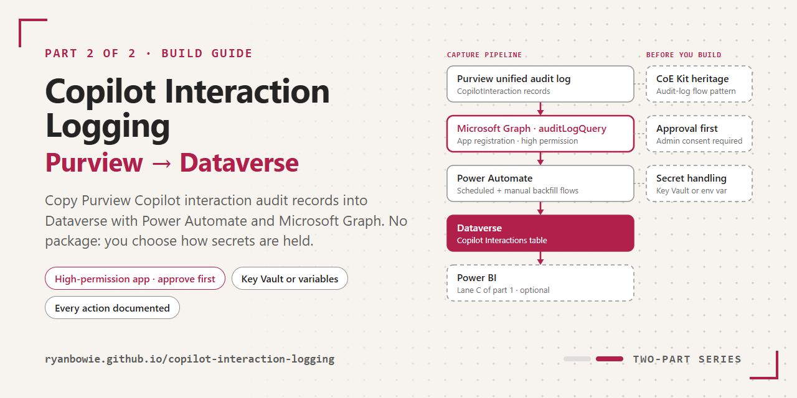](https://ryanbowie.github.io/copilot-interaction-logging/)

> **Community project. This is not a Microsoft product.** It is a personal project shared as-is under the [MIT licence](LICENSE). Microsoft does not support it, and no SLA or warranty applies. Read the whole of this page, then build and test in a non-production environment and get the approvals described in [Read this first](#read-this-first-high-privilege-tenant-wide-access) from your security and privacy owners **before** you build it anywhere that holds real data.

Copilot Interaction Logging is a build guide. It shows how to collect **metadata** about Microsoft 365 Copilot and Copilot Studio interactions from the Microsoft Purview unified audit log into Dataverse, using two Power Automate cloud flows and the Microsoft Graph audit log query API. From Dataverse you can report on usage with Power BI or any Dataverse client.

The build collects no prompt or response text.

> [!IMPORTANT]
> **Documentation only.** No solution package, flow export or source code is published. This page and the [action-by-action reference](docs/ACTION_REFERENCE.md) describe a tested reference build in enough detail for you to build your own. You own, secure and maintain whatever you build.

**Documentation site:** <https://ryanbowie.github.io/copilot-interaction-logging/> · [Action reference](docs/ACTION_REFERENCE.md) · [Changelog](CHANGELOG.md) · [Security](SECURITY.md)

## Contents

- [What you build](#what-you-build)
- [Read this first: high-privilege, tenant-wide access](#read-this-first-high-privilege-tenant-wide-access)
- [Do you need this? Built-in options first](#do-you-need-this-built-in-options-first)
- [Prerequisites and permissions](#prerequisites-and-permissions)
- [How it works](#how-it-works)
- [The HTTP calls](#the-http-calls)
  - [Recommended: consider a custom connector](#recommended-consider-a-custom-connector)
- [Secret-handling decision: how the client secret is stored](#secret-handling-decision-how-the-client-secret-is-stored)
- [Environment variables](#environment-variables)
- [Build from scratch](#build-from-scratch)
- [Data model](#data-model)
- [Reporting](#reporting)
- [Failure states and monitoring](#failure-states-and-monitoring)
- [Operations](#operations)
- [Troubleshooting](#troubleshooting)
- [Limitations](#limitations)
- [Origins and credit](#origins-and-credit)
- [Related](#related)
- [Licence](#licence)

## What you build

| Component | What it is | Details |
| --- | --- | --- |
| App registration | A Microsoft Entra ID app with the Microsoft Graph **application** permission `AuditLogsQuery.Read.All` | [Graph permissions](docs/ACTION_REFERENCE.md#graph-permissions) |
| Client secret store | Azure Key Vault (recommended) or a plain-text environment variable (not recommended). **You decide.** | [Secret-handling decision](#secret-handling-decision-how-the-client-secret-is-stored) |
| Dataverse tables | Copilot Interactions, Copilot Interaction Flow Runs and Copilot Interaction Flow Run Errors | [Data model](#data-model) |
| Environment variables | Seven, plus three legacy ones to leave out | [Environment variables](#environment-variables) |
| Connection reference | One, for Microsoft Dataverse | [Build from scratch](#build-from-scratch) |
| Scheduled flow | Runs daily and collects one UTC day from four days ago. 85 actions in the reference build. | [Action reference](docs/ACTION_REFERENCE.md) |
| Manual flow | Back-fills a date range you choose. 81 actions in the reference build. | [The manual flow](docs/ACTION_REFERENCE.md#the-manual-flow) |
| Report | Your own, for example Power BI with the Dataverse connector | [Reporting](#reporting) |

Build everything inside one Dataverse solution in a development environment, then promote it as a managed solution (see [Build from scratch](#build-from-scratch)).

## Read this first: high-privilege, tenant-wide access

> [!WARNING]
> The flows sign in as an Entra ID **app registration** that holds the Microsoft Graph **application** permission `AuditLogsQuery.Read.All`.
>
> - **The permission covers the whole tenant.** Application permissions can't be scoped to users, departments or sites, and this one reads the audit log for **every workload and record type**: Exchange, SharePoint, OneDrive, Entra ID, Teams and more, not only Copilot. The flows ask only for Copilot records, but the permission itself is not limited to them.
> - **Whoever holds the credential holds that access.** That includes anyone who can read the client secret or the Key Vault secret, and any automation that can. Treat the credential like a privileged admin credential.
> - **The collected rows are personal data.** Each row holds the user's UPN, client IP address and region, plus the names of the files, sites and other resources Copilot accessed. File and site names can reveal confidential work.
> - **Flow run history can show raw audit records.** In the reference build, the HTTP actions' *outputs* and the per-record actions aren't secured. Flow owners, co-owners and environment admins can therefore read the raw Graph responses and each record's values, including UPNs and IP addresses, for the run-history retention period (28 days by default). In your build, secure them as described in [Securing run history](docs/ACTION_REFERENCE.md#securing-run-history).

The app registration needs only `AuditLogsQuery.Read.All`. Microsoft Graph offers workload-scoped variants such as `AuditLogsQuery-Exchange.Read.All` and `AuditLogsQuery-SharePoint.Read.All`, but none is documented as covering Copilot interaction records, and the reference build hasn't been tested with them. `AuditLog.Read.All` is **not** enough for the audit log query API. See [Graph permissions](docs/ACTION_REFERENCE.md#graph-permissions), the [API permissions](https://learn.microsoft.com/graph/api/security-auditcoreroot-post-auditlogqueries?view=graph-rest-beta) and the [permissions reference](https://learn.microsoft.com/graph/permissions-reference).

> [!IMPORTANT]
> **Get approval before you build.** Your security and privacy owners should approve the app registration, the admin consent for `AuditLogsQuery.Read.All` and the [secret-handling option](#secret-handling-decision-how-the-client-secret-is-stored) before anyone creates them. Also confirm that a [built-in option](#do-you-need-this-built-in-options-first), such as Microsoft Sentinel's `CopilotActivity` table or Purview Audit search, doesn't already meet the need.

## Do you need this? Built-in options first

Microsoft already provides several supported ways to see Copilot activity. Check whether one of them meets the need before you build and maintain a custom collector.

| Need | Built-in option | Notes |
| --- | --- | --- |
| Adoption and usage numbers | [Microsoft 365 Copilot usage report](https://learn.microsoft.com/microsoft-365/admin/activity-reports/microsoft-365-copilot-usage) in the Microsoft 365 admin center; [Copilot Dashboard](https://learn.microsoft.com/viva/insights/org-team-insights/copilot-dashboard) (Viva Insights) | Aggregated, supported, no custom code. |
| Search or investigate individual interactions | [Microsoft Purview Audit search](https://learn.microsoft.com/purview/audit-search) ([Copilot audit records](https://learn.microsoft.com/purview/audit-copilot)) | 180 days' retention with Audit (Standard). Audit (Premium) keeps records for 1 year, or up to 10 years with an add-on ([retention policies](https://learn.microsoft.com/purview/audit-log-retention-policies)). |
| AI data-security posture, risky prompts, oversharing | [Microsoft Purview DSPM for AI](https://learn.microsoft.com/purview/dspm-for-ai) | Covers prompts and responses, which this build deliberately does not collect. |
| SIEM, long-term retention, correlation with security data | [Microsoft Sentinel `CopilotActivity` table](https://learn.microsoft.com/azure/azure-monitor/reference/tables/copilotactivity) ([connector reference](https://learn.microsoft.com/azure/sentinel/sentinel-tables-connectors-reference)) | Managed connector; retention is set in Log Analytics. |
| Hunting across Microsoft 365 activity | [Defender XDR advanced hunting `CloudAppEvents`](https://learn.microsoft.com/defender-xdr/advanced-hunting-cloudappevents-table) (application "Microsoft Copilot for Microsoft 365"; [release note](https://learn.microsoft.com/defender-cloud-apps/release-note-archive#march-2024)) | Requires Defender for Cloud Apps. |
| Bulk programmatic export | [Office 365 Management Activity API](https://learn.microsoft.com/office/office-365-management-api/office-365-management-activity-api-reference) ([Copilot schema](https://learn.microsoft.com/office/office-365-management-api/copilot-schema)) | Subscription-based content feed. |

**This build fits a narrower need.** It suits you when you want per-interaction rows in **your own Dataverse environment**, for example to join with your own agent inventory in Power BI or to keep summaries beyond your audit retention, and none of the options above is practical.

Prompts and responses aren't held in the audit log. They're stored in users' mailboxes and are subject to your retention and eDiscovery controls ([Copilot audit logs](https://learn.microsoft.com/purview/audit-copilot)).

## Prerequisites and permissions

| Area | Requirement | Why |
| --- | --- | --- |
| Microsoft 365 | Unified audit logging turned on ([turn auditing on or off](https://learn.microsoft.com/purview/audit-log-enable-disable), [set up Audit (Standard)](https://learn.microsoft.com/purview/audit-standard-setup)) | Copilot interactions are logged as part of Audit (Standard). |
| Microsoft 365 | The global service | The audit log query API isn't available in the US Government GCC High or DoD clouds, or in China. GCC tenants use the global endpoints. See [Which cloud](docs/ACTION_REFERENCE.md#which-cloud). |
| Entra ID | An app registration in your tenant ([register an app](https://learn.microsoft.com/entra/identity-platform/quickstart-register-app)) | The identity the flows sign in as. |
| Entra ID | Microsoft Graph **application** permission `AuditLogsQuery.Read.All`, with admin consent | Required by the audit log query API. |
| Entra ID | Privileged Role Administrator or Global Administrator, to grant consent | Consent to Microsoft Graph application permissions needs one of these roles. |
| Entra ID | A client secret on the app registration | Used by the HTTP actions. For certificates, see option C. |
| Power Platform | An environment with Dataverse | Holds the solution, tables and flows. |
| Power Platform | The builder is a System Administrator or System Customizer in that environment | Needed to create the tables, environment variables, connection reference and flows. |
| Power Platform | A Microsoft Dataverse connection, owned by the flow owner | Mapped to the build's connection reference ([connection references](https://learn.microsoft.com/power-apps/maker/data-platform/create-connection-reference)). |
| Power Platform | A premium Power Automate licence for the flow owner; for a busy tenant, consider a Process licence for the scheduled flow | The HTTP and Dataverse connectors are premium. Each record costs several Power Platform requests, so a busy tenant can exceed a user licence's daily request limit; see [Limitations](#limitations). |
| Power Platform | A data policy that allows HTTP and Dataverse together (or your custom connector and Dataverse, if you [use one](#recommended-consider-a-custom-connector)) | Otherwise the flows are suspended. |
| Azure (option A only) | A Key Vault, the `Microsoft.PowerPlatform` resource provider, and RBAC role assignments | See [option A](#option-a--azure-key-vault-recommended). |

## How it works

Each flow asks Microsoft Graph to run one audit log search for a time window, waits for the search to finish, reads the results a page at a time and upserts every record into Dataverse. A run log row tracks progress, and error rows record anything that failed. The reference adds a [component diagram and a sequence diagram](docs/ACTION_REFERENCE.md#architecture).

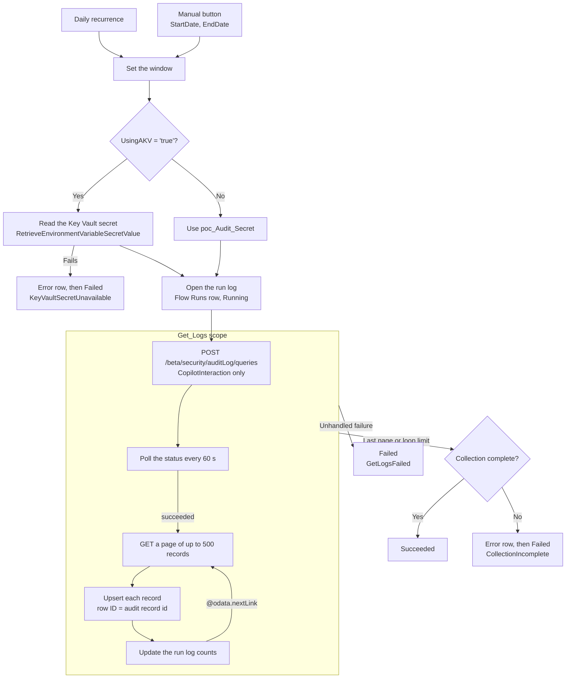

<p align="center"><a href="docs/images/flow-01-overview.png">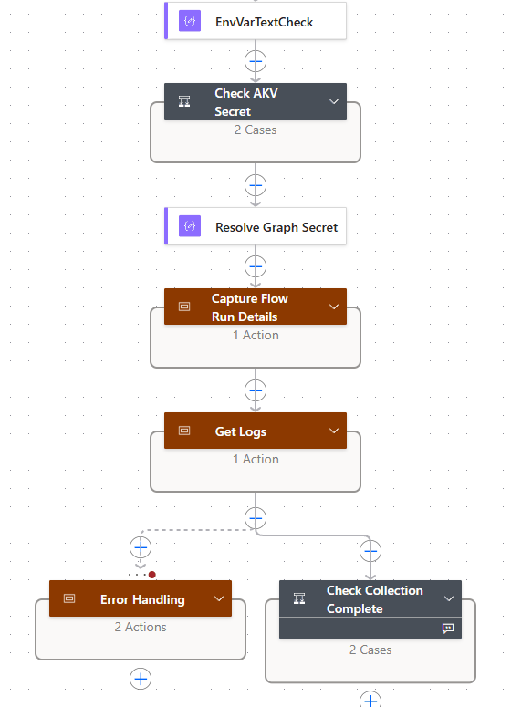</a><br><sub><i>Top level of the scheduled flow (variables collapsed). Reference build in the designer; includes legacy actions inherited from the CoE Starter Kit pattern that a clean build can omit.</i></sub></p>

Every part of the reference flow, in order (select an image to enlarge it):

| <a href="docs/images/flow-02-variables.png">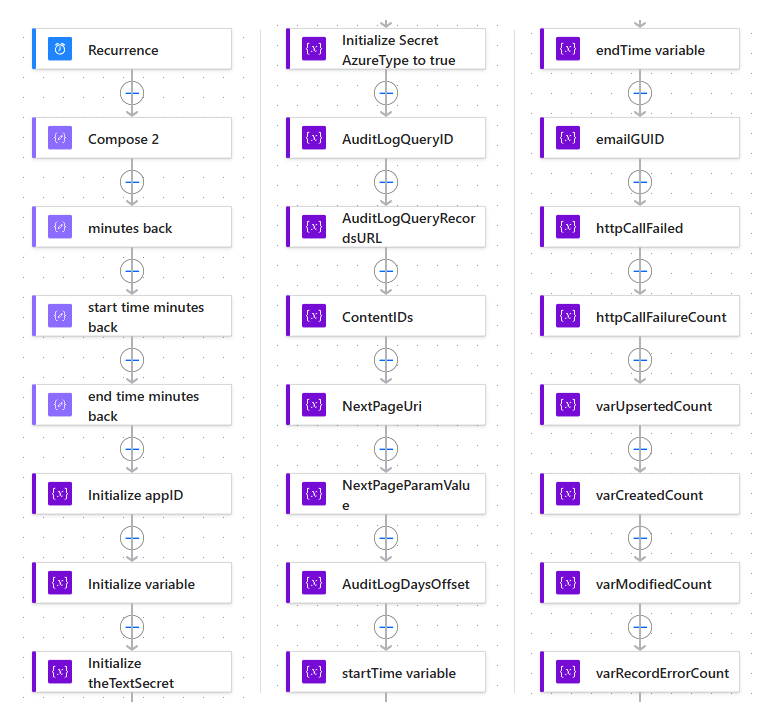</a><br><sub>A: [Initialise](docs/ACTION_REFERENCE.md#phase-a-initialise)</sub> | <a href="docs/images/flow-03-secret-and-runlog.png">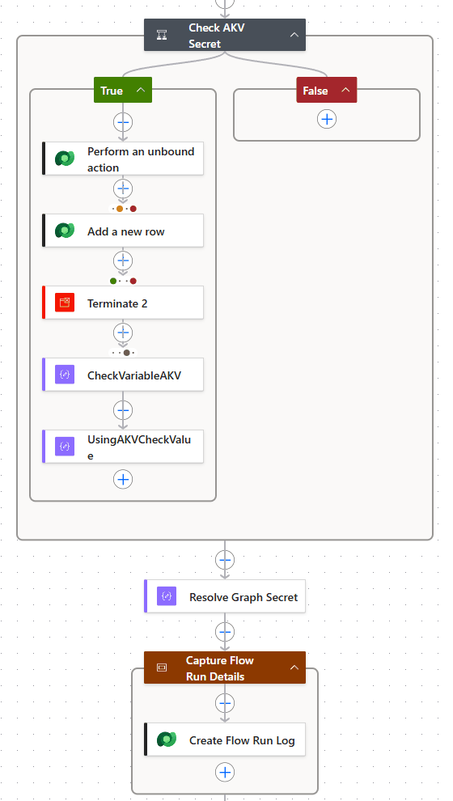</a><br><sub>B and C: [Secret](docs/ACTION_REFERENCE.md#phase-b-resolve-the-graph-secret) and [run log](docs/ACTION_REFERENCE.md#phase-c-open-the-run-log)</sub> | <a href="docs/images/flow-04-create-query.png">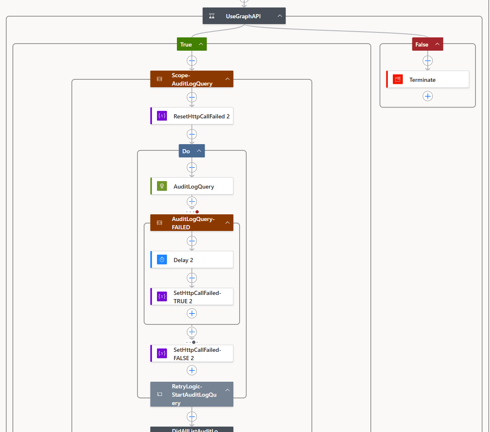</a><br><sub>D1: [Create the query](docs/ACTION_REFERENCE.md#d1-create-the-audit-log-query)</sub> |
| :---: | :---: | :---: |
| <a href="docs/images/panel-create-query.png">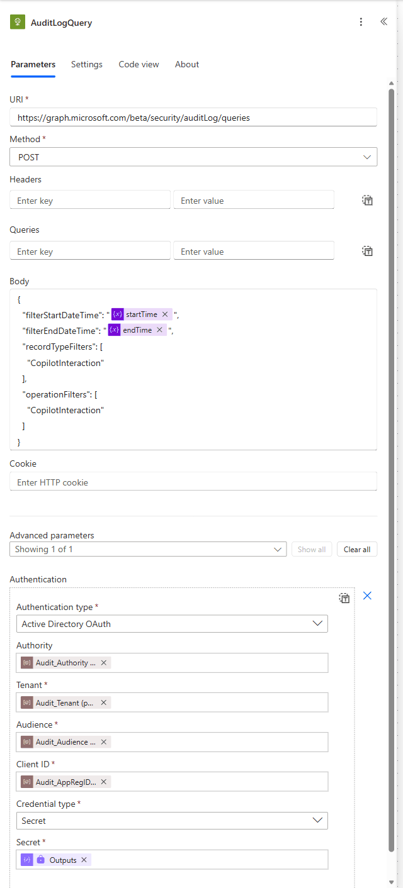</a><br><sub>D1: [The HTTP request](docs/ACTION_REFERENCE.md#http-authentication)</sub> | <a href="docs/images/flow-05-poll-query.png">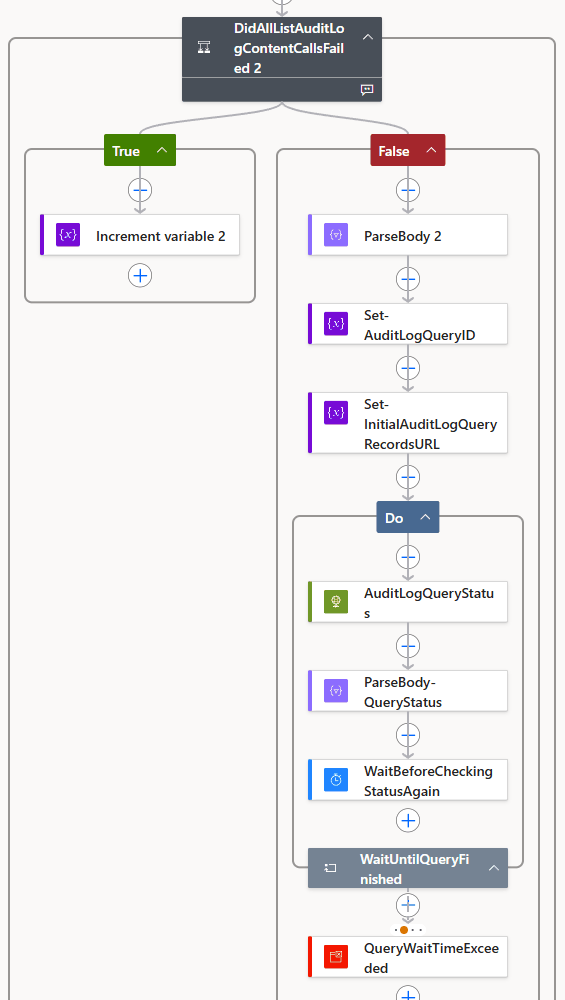</a><br><sub>D2: [Wait for the query](docs/ACTION_REFERENCE.md#d2-wait-for-the-query-to-finish)</sub> | <a href="docs/images/flow-06-fetch-page.png">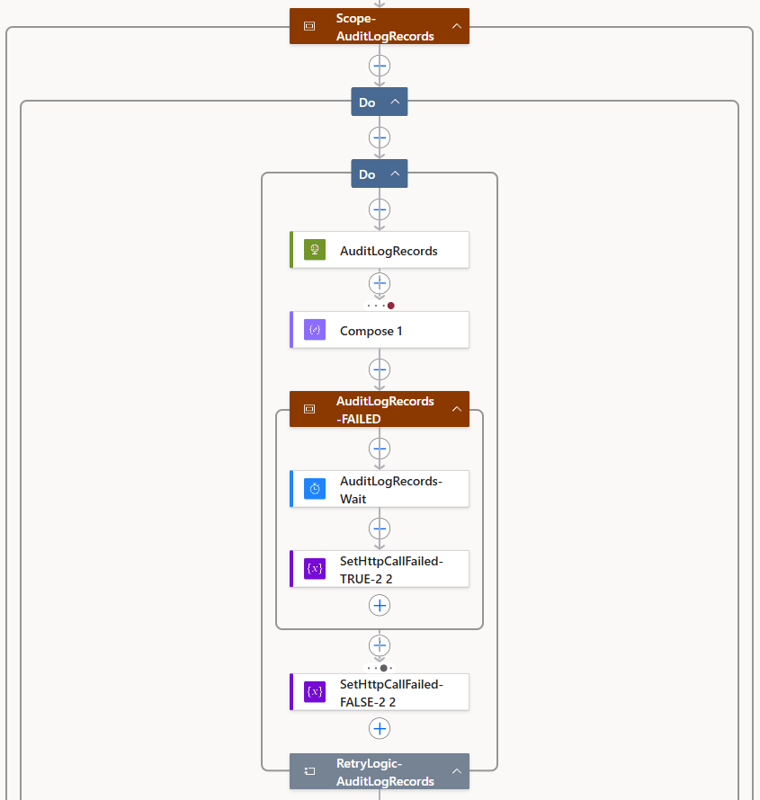</a><br><sub>D3: [Fetch a page](docs/ACTION_REFERENCE.md#d3-fetch-a-page-of-records)</sub> |
| <a href="docs/images/flow-07-per-record-upsert.png">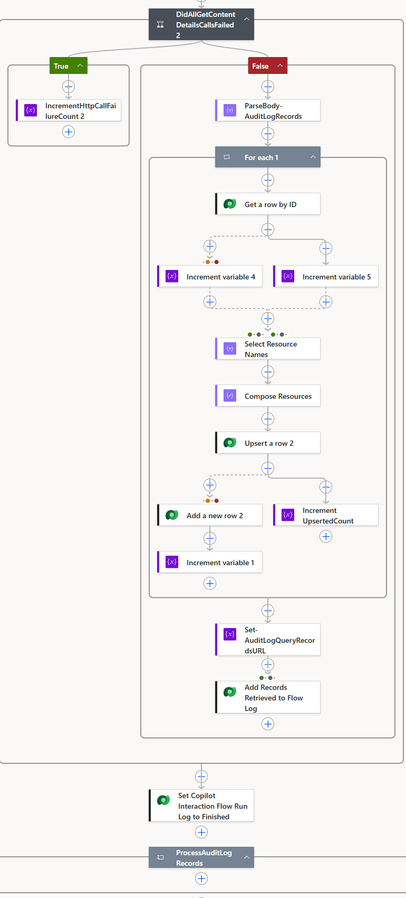</a><br><sub>D4: [Upsert each record](docs/ACTION_REFERENCE.md#d4-upsert-each-record)</sub> | <a href="docs/images/panel-upsert-mapping.png">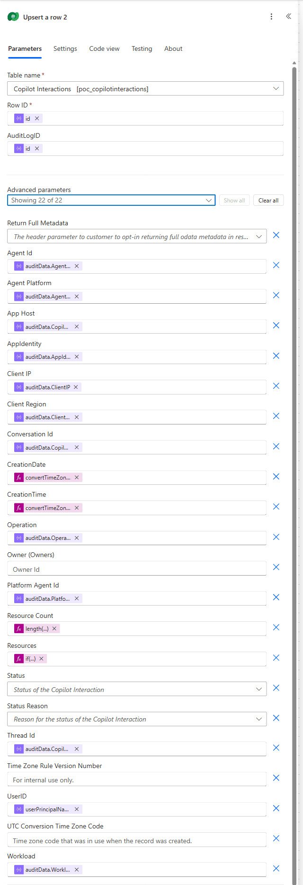</a><br><sub>D4: [Column mapping](docs/ACTION_REFERENCE.md#upsert-mapping)</sub> | <a href="docs/images/flow-08-error-and-completeness.png">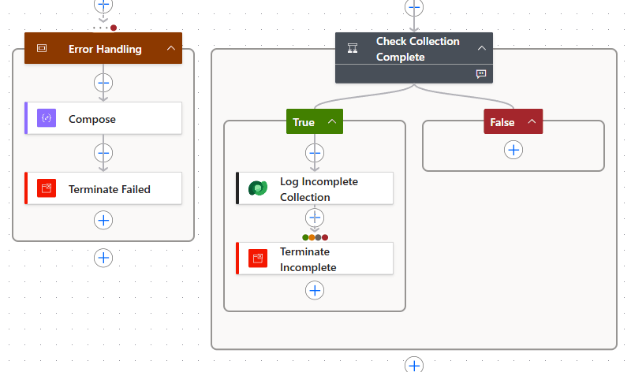</a><br><sub>E and F: [Error handling and completeness](docs/ACTION_REFERENCE.md#phases-e-and-f-error-handling-and-completeness)</sub> |

Phases D1 to D4 sit inside one scope, `Get_Logs`. The scheduled flow has 85 actions: A 23, B 8, C 2, D1 16, D2 5, D3 12, D4 13, E 3 and F 3. The [phase map](docs/ACTION_REFERENCE.md#phase-map) lists them.

1. **Set the window.** The scheduled flow runs once a day (time zone GMT Standard Time) and collects one UTC day, from `startOfDay(addDays(utcNow(), -4))` to `startOfDay(addDays(utcNow(), -3))`, so a run on 10 March collects 6 March. The lag allows for audit records that arrive late. The manual flow collects from StartDate to EndDate, and EndDate is exclusive. See [Phase A](docs/ACTION_REFERENCE.md#phase-a-initialise).
2. **Resolve the secret and open the run log.** If `poc_Audit_UsingAKVtruefalse` is `true`, the flow reads the client secret from Azure Key Vault with the Dataverse unbound action `RetrieveEnvironmentVariableSecretValue`. Otherwise it uses the plain-text variable `poc_Audit_Secret`. The Key Vault action has secure inputs and outputs, and the Compose actions that pass the secret on have secure inputs, so the secret is [hidden in run history](https://learn.microsoft.com/azure/logic-apps/logic-apps-securing-a-logic-app#secure-data-in-run-history-by-using-obfuscation). The flow then adds a run log row with **Flow State** set to Running. See [Phase B](docs/ACTION_REFERENCE.md#phase-b-resolve-the-graph-secret) and [Phase C](docs/ACTION_REFERENCE.md#phase-c-open-the-run-log).
3. **Create the query.** An HTTP action sends `POST /beta/security/auditLog/queries` with the window, and with `recordTypeFilters` and `operationFilters` both set to `["CopilotInteraction"]` ([create auditLogQuery](https://learn.microsoft.com/graph/api/security-auditcoreroot-post-auditlogqueries?view=graph-rest-beta), [auditLogQuery](https://learn.microsoft.com/graph/api/resources/security-auditlogquery?view=graph-rest-beta)). A retry loop makes up to 5 attempts within 5 minutes, 20 seconds apart. See [D1](docs/ACTION_REFERENCE.md#d1-create-the-audit-log-query).
4. **Wait for the query.** Purview runs the search in the background. The flow checks the query's status every 60 seconds until it's `succeeded`. See [D2](docs/ACTION_REFERENCE.md#d2-wait-for-the-query-to-finish).
5. **Read the records.** The flow reads the results up to 500 at a time ([list auditLogRecords](https://learn.microsoft.com/graph/api/security-auditlogquery-list-records?view=graph-rest-beta)) and follows `@odata.nextLink` to the next page. Each page read gets up to 5 attempts within 10 minutes, 30 seconds apart. All three HTTP actions have secure inputs, which hide the secret, but their outputs aren't secured in the reference build, so run history shows the records ([Securing run history](docs/ACTION_REFERENCE.md#securing-run-history)). See [D3](docs/ACTION_REFERENCE.md#d3-fetch-a-page-of-records).
6. **Write each record.** For every [audit log record](https://learn.microsoft.com/graph/api/resources/security-auditlogrecord?view=graph-rest-beta), `Get_a_row_by_ID` checks whether it's already stored (only so that new and existing records can be counted), then `Upsert_a_row_2` writes it with the row ID set to the audit record id, so re-running a window never creates duplicates. If an upsert fails, a [run-after](https://learn.microsoft.com/azure/logic-apps/error-exception-handling#manage-the-run-after-behavior) branch adds a "Failed - Upsert a row 2" error row and adds 1 to **Records Error**; that record isn't saved. The flow moves to the next page only after every record on the page succeeds, so a failed page is read again, and a failure that persists ends in `CollectionIncomplete`. See [D4](docs/ACTION_REFERENCE.md#d4-upsert-each-record).
7. **Finish, or fail loudly.** If the query never started or pages were left unread, the flow writes an error row and ends the run as **Failed** with `CollectionIncomplete`. An unhandled failure inside `Get_Logs` ends the run as **Failed** with `GetLogsFailed`. Otherwise the run ends **Succeeded**. See [Phases E and F](docs/ACTION_REFERENCE.md#phases-e-and-f-error-handling-and-completeness).

### Loop limits

| Loop | Scheduled flow | Manual flow |
| --- | --- | --- |
| Create the query (`RetryLogic-StartAuditLogQuery`) | 5 attempts or 5 minutes | Same |
| Wait for the query (`WaitUntilQueryFinished`) | 480 checks or 8 hours | 300 checks or 3 hours |
| Read pages (`ProcessAuditLogRecords`) | 100 pages or 10 hours (about 50,000 records) | 1,000 pages or 10 hours (about 500,000 records) |
| Retry a page (`RetryLogic-AuditLogRecords`) | 5 attempts or 10 minutes | Same |

- **A loop that reaches its limit ends Succeeded**, and the flow carries on (tested with a mock flow; see [Until loop considerations](https://learn.microsoft.com/azure/logic-apps/logic-apps-control-flow-loops#until-loop-considerations)). The completeness check catches a paging loop that stopped early, but not a wait loop that gave up before the query finished.
- **Time usually runs out before pages do.** Records are written one at a time, at about 25 to 60 a minute, so the 10-hour limit is reached at about 15,000 to 36,000 records, well before 100 pages.
- **A run can be long.** At the scheduled limits a run can take about 18 hours. A cloud flow run can last up to 30 days.
- **The endpoint is beta.** Graph beta APIs can change without notice.

Details, and how to size the limits for your volumes: [Loop limits](docs/ACTION_REFERENCE.md#loop-limits) and [Planning for high volumes](docs/ACTION_REFERENCE.md#planning-for-high-volumes).

## The HTTP calls

Three HTTP actions do all the talking to Microsoft Graph. `AuditLogQuery` creates an audit log query, `AuditLogQueryStatus` waits for it to finish, and `AuditLogRecords` reads its records a page at a time. This section shows what each one sends and what the Parse JSON action after it expects back. The flows use no Graph connector: the HTTP actions sign in on their own, as in the CoE Starter Kit pattern. For your own build, [consider a custom connector](#recommended-consider-a-custom-connector).

**How each call signs in.** All three actions use **Active Directory OAuth** to get an app-only token, so no user signs in and no connection is needed.

| Field | Value |
| --- | --- |
| Authority | `Audit_Authority`, default `https://login.windows.net` |
| Tenant | `Audit_Tenant`: your directory (tenant) ID |
| Audience | `Audit_Audience`, default `https://graph.microsoft.com` |
| Client ID | `Audit_AppRegID` |
| Credential type | Secret, from the output of `Resolve_Graph_Secret` (option A or B), or Certificate (option C) |

Turn on secure inputs for all three actions, so the secret and the token request stay out of run history.

**What the app registration needs.** The Microsoft Graph **application** permission `AuditLogsQuery.Read.All`, with admin consent. Tested on the beta endpoint, it covers all three calls. `AuditLog.Read.All` isn't enough. Moving to v1.0 is untested: see [Switching to v1.0](docs/ACTION_REFERENCE.md#switching-to-v10).

| Step | Request | Success and retries | What happens with the response |
| --- | --- | --- | --- |
| **D1** `AuditLogQuery` | `POST …/security/auditLog/queries` with the JSON body below | `201 Created`. Wrapped in `RetryLogic-StartAuditLogQuery`: up to 5 attempts or 5 minutes, waiting 20 seconds after a failure. | `ParseBody_2` reads the new query's `id`. `Set-AuditLogQueryID` keeps it, and `Set-InitialAuditLogQueryRecordsURL` builds the first page's URL: `…/queries/{query-id}/records?$top=500`. |
| **D2** `AuditLogQueryStatus` | `GET …/security/auditLog/queries/{query-id}`, no body | `WaitUntilQueryFinished` asks every 60 seconds until the status is `succeeded`: up to 480 checks or 8 hours (manual flow: 300 checks or 3 hours). | `ParseBody-QueryStatus` reads `status`: `notStarted`, `running`, `succeeded`, `failed` or `cancelled`. |
| **D3** `AuditLogRecords` | `GET {records URL}`, no body and no extra headers. The first URL comes from D1; each later one is the previous page's `@odata.nextLink`. | `200 OK`. Wrapped in `RetryLogic-AuditLogRecords`: up to 5 attempts or 10 minutes, waiting 30 seconds after a failure. The outer loop, `ProcessAuditLogRecords`, makes one pass per page: up to 100 pages (manual flow: 1,000) or 10 hours. | `ParseBody-AuditLogRecords` reads `value`, an array of up to 500 records, and `@odata.nextLink`. D4 upserts each record, then copies the link into the records URL. The last page has no link, so the loop ends (tested with 550 records over two pages). |

`…` stands for `https://graph.microsoft.com/beta`. Placeholders in braces are filled in by the flow at run time.

**The D1 request body.** The two variables hold the one-day window that phase A works out; the end time is exclusive. Filtering on the record type and the operation keeps the query to Copilot interactions. This `recordTypeFilters` value works on beta only; v1.0 has no such member.

```json
{
  "filterStartDateTime": "@{variables('startTime')}",
  "filterEndDateTime": "@{variables('endTime')}",
  "recordTypeFilters": ["CopilotInteraction"],
  "operationFilters": ["CopilotInteraction"]
}
```

**A records schema that won't stall paging.** The reference schema marks 13 properties of each record as required. One record that lacks any of them, or has `null` in a typed one, fails Parse JSON: the page isn't written, the URL doesn't move on, and the same page is read again until the loop limits. Requiring only `id` avoids that. Validate it against a page from your own tenant:

```json
{
  "type": "object",
  "properties": {
    "@odata.nextLink": { "type": "string" },
    "value": {
      "type": "array",
      "items": {
        "type": "object",
        "properties": {
          "id": { "type": "string" },
          "userPrincipalName": {},
          "auditData": {}
        },
        "required": ["id"]
      }
    }
  }
}
```

**How the retries work.** D1 and D3 each sit inside a small **Do until** loop, a pattern inherited from the CoE Starter Kit. If the call fails, a failure scope waits and sets `httpCallFailed` to true, and the loop tries again. If the last attempt still failed, a condition adds 1 to `httpCallFailureCount`, which the completeness check in phase F reports. The HTTP actions' own retry policy already handles timeouts (408), throttling (429) and server errors (5xx). It doesn't retry authentication errors such as 401, but the loop still makes its five attempts. Tested with an invalid client secret: D1 used all five, D3 then failed on an empty URL, and the run ended as Failed after about 4.5 minutes, with "query started: no" in the completeness check.

> [!WARNING]
> **Three gaps to close in your build.**
>
> - Only `succeeded` ends the D2 wait. Also stop on `failed` or `cancelled`, then fail the run unless the status is `succeeded`. The reference build's `QueryWaitTimeExceeded` action never runs, so don't rely on it.
> - Skip D3 when D1 didn't return a query ID, instead of reading an empty URL.
> - Turn on secure outputs for `AuditLogRecords`, because each page holds user names, IP addresses and file names ([Securing run history](docs/ACTION_REFERENCE.md#securing-run-history)).

Every action, with its inputs and run-after settings: [D1](docs/ACTION_REFERENCE.md#d1-create-the-audit-log-query), [D2](docs/ACTION_REFERENCE.md#d2-wait-for-the-query-to-finish), [D3](docs/ACTION_REFERENCE.md#d3-fetch-a-page-of-records), [HTTP authentication](docs/ACTION_REFERENCE.md#http-authentication) and [Limits and throttling](docs/ACTION_REFERENCE.md#limits-and-throttling).

### Recommended: consider a custom connector

> [!TIP]
> **Review the HTTP actions before you go to production.** The flows call Graph with the built-in HTTP action because they're adapted from the CoE Starter Kit's audit log flows, which work the same way. Consider wrapping the three Graph calls in a [custom connector](https://learn.microsoft.com/connectors/custom-connectors/) instead.

**Why it helps**

- **Governance.** Data policies can classify a custom connector on its own, by name in an environment or by host URL across the tenant ([data policies for custom connectors](https://learn.microsoft.com/power-platform/admin/dlp-custom-connector-parity)). The environment then doesn't have to allow the general-purpose HTTP connector.
- **No secret in the flow.** The connector and its connection hold the sign-in, so no secret passes through the flow's actions or run history, and the Phase B secret lookup is no longer needed.
- **Reuse.** The three calls become named operations with defined request and response schemas, shared by every flow that uses the connector.

**Check before you switch**

- **The sign-in changes.** Microsoft notes: "Currently, client credentials grant type is not supported by custom connectors" ([authentication](https://learn.microsoft.com/connectors/custom-connectors/connection-parameters)). That's the app-only sign-in the HTTP actions use. The connection would sign in as a user account with delegated Graph permissions instead, or the connector would call an endpoint you host, for example in Azure API Management, that signs in to Graph with a managed identity. Either way, who holds the access changes, so put it through the same security review as the app registration.
- **Secrets.** If the connector needs a client secret, keep it in a Secret-type environment variable backed by Azure Key Vault. A Text-type one "isn't secure. These values aren't encrypted" ([environment variables in custom connectors](https://learn.microsoft.com/connectors/custom-connectors/environment-variables)).
- **Paging.** Graph says to use the entire `@odata.nextLink` URL: "Don't try to extract the `$skiptoken` or `$skip` value and use it in a different request" ([paging](https://learn.microsoft.com/graph/paging)). Make sure the connector can follow that URL.
- **Re-test.** Rebuild D1 to D3 in a sandbox, and compare the query wait, paging, retries and row counts with the HTTP build before you remove the HTTP actions. Both are premium, so licensing doesn't change.

What changes action by action: [Consider a custom connector](docs/ACTION_REFERENCE.md#consider-a-custom-connector).

## Secret-handling decision: how the client secret is stored

> [!IMPORTANT]
> **Choose before you build.** The flows authenticate to Microsoft Graph with the app registration's credential, and where that credential lives is your decision, agreed with your security team. Nothing in this guide is pre-filled: you create every environment variable and enter every value yourself.

| | **A. Azure Key Vault** (recommended) | **B. Plain-text environment variable** (not recommended) | **C. Certificate** (advanced) |
| --- | --- | --- | --- |
| Where the secret lives | A Key Vault secret. Dataverse holds only a reference to it. | A Text environment variable value in Dataverse | A certificate (PFX) and its password, ideally in Key Vault |
| Who can read it | Identities with **Key Vault Secrets User** on the vault, and Dataverse when a flow asks for it | Anyone who can read environment variable values in the environment | As option A or B, depending on where you store the PFX and password |
| Exported with the solution? | Only the reference, never the secret | **Yes, in clear text**, if a current value is in the solution. Remove it before export. | As option A or B |
| Rotation | Update the secret in Key Vault, then save the flows or turn them off and on | Update the value, then save the flows or turn them off and on | Upload a new certificate, then update the stored PFX and password |
| Effort | Medium: Azure subscription, vault, RBAC and networking | Low | High: in both flows, set **Credential Type** to Certificate on `AuditLogQuery`, `AuditLogQueryStatus` and `AuditLogRecords` ([HTTP authentication](docs/ACTION_REFERENCE.md#http-authentication)). The reference build was tested with a client secret only. |
| Settings | `poc_Audit_UsingAKVtruefalse` = `true`; `poc_KeyVaultSecret` set; `poc_Audit_Secret` empty | `poc_Audit_UsingAKVtruefalse` = `false`; `poc_Audit_Secret` set | Your own variables for the PFX and password |
| Suits | Production | Not recommended; at most an isolated test environment with a short-lived secret | Production, where policy requires certificates |

> [!CAUTION]
> **The switch is an exact text match.** In the reference build, only `true` (lower case, no spaces) is guaranteed to select Key Vault. A value such as `yes`, or `true` with a trailing space, silently selects the plain-text secret instead. If that's empty, sign-in fails with `AADSTS7000215` and nothing points to the switch. In your build, normalise the value with `toLower(trim(...))` or use a Two options variable.

### Option A — Azure Key Vault (recommended)

Follow Microsoft's [Use Azure Key Vault secrets](https://learn.microsoft.com/power-apps/maker/data-platform/environmentvariables-azure-key-vault-secrets) guidance. In summary:

1. Register the `Microsoft.PowerPlatform` resource provider in the Azure subscription that holds the vault.
2. Use a vault in the same tenant as Power Platform, with the [Azure RBAC permission model](https://learn.microsoft.com/azure/key-vault/general/rbac-guide). Microsoft suggests a separate vault for each environment.
3. Add a secret that holds the client secret's **Value** (not its Secret ID).
4. Assign the **Key Vault Secrets User** role to the user who will create the environment variable, and to the Dataverse service principal with application ID `00000007-0000-0000-c000-000000000000`. Remove any Dataverse role assignment with a different application ID.
5. If the vault's firewall is on, remember that Power Platform isn't covered by the "Trusted Services Only" option. Allow the [Power Platform IP addresses](https://learn.microsoft.com/power-platform/admin/online-requirements#ip-addresses-required), or use [virtual network support](https://learn.microsoft.com/power-platform/admin/vnet-support-overview).
6. Create `poc_KeyVaultSecret` as a **Secret** environment variable. Power Apps asks for the subscription ID, resource group name, vault name and secret name, and builds the reference: `/subscriptions/{subscriptionId}/resourceGroups/{resourceGroupName}/providers/Microsoft.KeyVault/vaults/{keyVaultName}/secrets/{secretName}`.
7. Set `poc_Audit_UsingAKVtruefalse` to `true`, and leave `poc_Audit_Secret` empty.

**How the flow reads it.** Secret environment variables aren't available in the dynamic content selector, so the flow calls the Dataverse unbound action `RetrieveEnvironmentVariableSecretValue` with the variable's schema name and reads `outputs('Perform_an_unbound_action')?['body/EnvironmentVariableSecretValue']`. The action has secure inputs and outputs. If it fails, the flow writes an error row (no run log row exists yet) and ends the run as **Failed** with `KeyVaultSecretUnavailable`, before any Graph call is made. Secret environment variables work only with Power Automate flows, Copilot Studio agents and custom connectors.

### Option B — Plain-text environment variable (not recommended)

> [!CAUTION]
> **Not recommended.** This option stores a credential for a tenant-wide, high-privilege permission in clear text. Use Key Vault (option A) or a certificate (option C) instead. It's documented only because the reference build was live-tested this way. If you use it at all, keep it to a short-lived secret in an isolated test environment.

1. Set `poc_Audit_UsingAKVtruefalse` to `false`.
2. Enter the client secret's **Value**, not its Secret ID, as the **Current value** of `poc_Audit_Secret`. Leave its **Default value** empty, because the default is part of the variable's definition and is always exported.
3. Use a short-lived secret, and keep it to an isolated test environment.
4. Before you export the solution, open the variable and, under **Current Value**, select **...** > **Remove from this solution**.

See [Environment variables overview](https://learn.microsoft.com/power-apps/maker/data-platform/environmentvariables) and [Storing the client secret](docs/ACTION_REFERENCE.md#storing-the-client-secret).

### Option C — Certificate (advanced)

Microsoft recommends a certificate rather than a client secret in production. Upload the certificate's public key to the app registration ([certificate credentials](https://learn.microsoft.com/entra/identity-platform/certificate-credentials)). Then, in both flows, set **Credential Type** to Certificate on the three HTTP actions, and supply **Pfx** (the base64 content of the PFX file) and **Password**. Store both as you would a client secret, ideally in Key Vault, and pass them through a Compose action with secure inputs, as `Resolve_Graph_Secret` does. The reference build hasn't been tested with a certificate, so validate the change with the manual flow before you rely on it. See [HTTP authentication](docs/ACTION_REFERENCE.md#http-authentication).

## Environment variables

The flows read their settings from Dataverse environment variables, so the same flows work in every environment. `poc` is the reference build's publisher prefix; yours will be your own publisher's prefix. In code view, a flow refers to a variable by display name and schema name, for example `parameters('Audit_Tenant (poc_Audit_Tenant)')`. Create these:

| Schema name | Display name | Type | Default value | Purpose | Clean build |
| --- | --- | --- | --- | --- | --- |
| `poc_Audit_Tenant` | Audit_Tenant | Text | (none) | Your tenant ID, for the HTTP actions' **Tenant** | **Keep** |
| `poc_Audit_AppRegID` | Audit_AppRegID | Text | (none) | The app registration's client ID | **Keep** |
| `poc_Audit_UsingAKVtruefalse` | Audit_UsingAKVtruefalse | Text | `false` | The secret-storage switch. Only `true` selects Key Vault. | **Change.** Normalise the value, or use Two options. |
| `poc_KeyVaultSecret` | KeyVaultSecret | Secret | (none) | Option A: the Key Vault reference | **Keep** for option A |
| `poc_Audit_Secret` | Audit_Secret | Text | (none) | Option B: the client secret value | **Keep** for option B only |
| `poc_Audit_Authority` | Audit_Authority | Text | `https://login.windows.net` | The sign-in authority | **Keep** |
| `poc_Audit_Audience` | Audit_Audience | Text | `https://graph.microsoft.com` | The token audience | **Keep** |

Don't create the three legacy variables in the reference build: `poc_Audit_ReviewerEmail` (unused), `poc_AuditMinutestoLookBack` (Decimal number, 65) and `poc_AuditEndTimeMinutesAgo` (Decimal number, 2820). Only legacy Compose actions read the last two.

**Changing a value.** Flows keep using the previous value until they're saved, or turned off and on again. After any change, save both flows and run the manual flow over a short window. See [Changing a value](docs/ACTION_REFERENCE.md#changing-a-value) and [Environment variables](docs/ACTION_REFERENCE.md#environment-variables).

## Build from scratch

No solution package is published, so you create every component yourself, in this order, in a development environment. You choose the secret option, publisher prefix, retention and security that fit your organisation. Get the approvals in [Read this first](#read-this-first-high-privilege-tenant-wide-access) before step 1. Each step links the detail you need.

1. **Register the app.** Create a single-tenant app registration, add the Microsoft Graph **application** permission `AuditLogsQuery.Read.All` and grant admin consent. Add a client secret with an expiry of less than 12 months (24 months at most), and copy its **Value** straight away. A certificate is preferred in production. See [Graph permissions](docs/ACTION_REFERENCE.md#graph-permissions).
2. **Store the secret** using [option A, B or C](#secret-handling-decision-how-the-client-secret-is-stored).
3. **Create a solution.** In the development environment, create a solution with your own publisher, and build everything below inside it ([solution concepts](https://learn.microsoft.com/power-platform/alm/solution-concepts-alm), [create a solution](https://learn.microsoft.com/power-apps/maker/data-platform/create-solution)).
4. **Create the three tables** with the columns in [Dataverse tables](docs/ACTION_REFERENCE.md#dataverse-tables-written-by-the-flows), applying its clean-build changes ([create tables](https://learn.microsoft.com/power-apps/maker/data-platform/create-edit-entities-portal)). When a flow sets a choice column, pick the option by its label.
5. **Create the environment variables** in the table above ([environment variables in flows](https://learn.microsoft.com/power-apps/maker/data-platform/environmentvariables-power-automate)).
6. **Create a connection reference** for Microsoft Dataverse, mapped to a connection owned by the flow owner. If you use a [custom connector](#recommended-consider-a-custom-connector) for the Graph calls, create it in the solution first, and add a connection reference for it too.
7. **Build the scheduled flow** phase by phase, from [Phase A](docs/ACTION_REFERENCE.md#phase-a-initialise) to [Phases E and F](docs/ACTION_REFERENCE.md#phases-e-and-f-error-handling-and-completeness), then the [manual flow](docs/ACTION_REFERENCE.md#the-manual-flow). Apply the [recommended settings](docs/ACTION_REFERENCE.md#recommended-settings) and size the [loop limits](docs/ACTION_REFERENCE.md#loop-limits). Add a note to each action saying why it exists ([solution-aware flows](https://learn.microsoft.com/power-automate/overview-solution-flows)).
8. **Validate.** Run the manual flow over one day that's at least four days old. Compare the row count with a Purview Audit search for the same day, check the run log and error rows, and confirm that run history hides the secret. Work through the [clean-build checklist](docs/ACTION_REFERENCE.md#clean-build-checklist).
9. **Lock it down.** Give report readers a read-only security role, schedule a bulk-delete job for your retention period, confirm the data policy and set up monitoring (see [Failure states and monitoring](#failure-states-and-monitoring)).
10. **Promote it.** Before you export, remove the **current value** of every environment variable from the solution (**...** > **Remove from this solution**), so no secret, tenant ID or client ID leaves the environment. Export the solution as managed and import it into test, then production ([export solutions](https://learn.microsoft.com/power-apps/maker/data-platform/export-solutions)), and set the values in each target environment after import.

## Data model

The flows write to three custom tables. All three are user or team owned, and none uses auditing, change tracking or alternate keys. This guide includes no security role, so create your own. Full column lists, schema names and types are in [Dataverse tables](docs/ACTION_REFERENCE.md#dataverse-tables-written-by-the-flows), and the source of every column is in [Upsert mapping](docs/ACTION_REFERENCE.md#upsert-mapping).

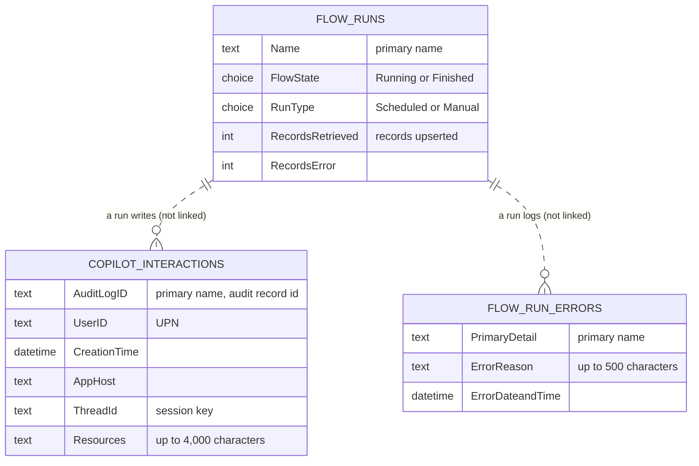

The tables aren't related in the reference build. A clean build adds a lookup from each error row to its run.

**Copilot Interactions** holds one row per audit record. **AuditLogID** (Text, 850) is the primary name column and holds the audit record id. The upsert also sets the row's primary key from the same id, so re-running a window updates rows rather than duplicating them. The other columns are:

| Group | Columns |
| --- | --- |
| Who and where | **UserID** (the user's UPN), **Client IP** (about 58% populated in the reference data), **Client Region** |
| When | **CreationTime** (Date and time, User local) and **CreationDate** (Date only, Time zone independent) |
| What | **Operation**, **Workload**, **AppIdentity**, **App Host** (`CopilotEventData.AppHost`, for example Teams or Word) |
| Agent | **Agent Id**, **Agent Platform**, **Platform Agent Id** |
| Session | **Conversation Id**, **Thread Id** |
| Resources | **Resources** (distinct resource names separated by "; ", cut to 4,000 characters) and **Resource Count** (the length of the raw array, before duplicates are removed) |

Five of these fields (**Agent Id**, **AppIdentity**, **Conversation Id**, **Agent Platform** and **Platform Agent Id**) aren't in Microsoft's published Copilot schema, or are only partly documented. Check them against your own data before you rely on them. **Resources** can reveal the names of confidential files and sites.

> [!WARNING]
> **CreationTime is an hour out during British Summer Time.** The reference build converts the audit time from UTC to UK time and sends it with no offset, and Dataverse stores a value without an offset as UTC. In your build, send UTC: `formatDateTime(items('For_each_1')?['auditData']?['CreationTime'], 'yyyy-MM-ddTHH:mm:ssZ')` for **CreationTime**, and `formatDateTime(items('For_each_1')?['auditData']?['CreationTime'], 'yyyy-MM-dd')` for **CreationDate**. See [Upsert mapping](docs/ACTION_REFERENCE.md#upsert-mapping).

**Copilot Interaction Flow Runs** is the run log, with one row per run. **Name** is a label plus the run start time; in your build, use your own label rather than the flow's display name. It also holds **Audit Query Start Date**, **Audit Query End Date**, **Flow Start Date and Time**, **Run Type** (Scheduled or Manual), **Records Created** and **Records Modified**.

- **Flow State** is Running or Finished. There's no Failed value, so check the run's status in run history, not this column.
- **Records Retrieved** counts the records upserted, not the records read. **Records Error** counts records that weren't saved.
- The counts are running totals kept in flow variables, so treat them as indicative.

**Copilot Interaction Flow Run Errors** holds one row per failure, with **Primary Detail**, **Error Reason** (500 characters), **Error Date** and **Error Date and Time**. There are three kinds of row:

| Primary Detail starts with | Written when | Error Reason |
| --- | --- | --- |
| "Failed - Upsert a row 2" | A record couldn't be written ([D4](docs/ACTION_REFERENCE.md#d4-upsert-each-record)) | Fixed text naming the action |
| "Failed - Collection incomplete - window … - run … - {time}" | The query never started, or pages were left unread ([Phase F](docs/ACTION_REFERENCE.md#phases-e-and-f-error-handling-and-completeness)) | Query started (yes or no), pages left unread (yes or no) and the number of failed Graph calls |
| "Failed - Unbound Action call to AKV - {time}" | The Key Vault secret couldn't be read ([Phase B](docs/ACTION_REFERENCE.md#phase-b-resolve-the-graph-secret)) | What to check: the variable, permissions, network rules and expiry |

> [!IMPORTANT]
> **Copilot Interactions holds personal data.** Restrict all three tables with security roles, agree a retention period and delete older rows on a schedule with a [bulk deletion](https://learn.microsoft.com/power-platform/admin/delete-bulk-records) job.

## Reporting

The build is a collector only: you build the report. Connect Power BI to the three tables with the [Dataverse connector](https://learn.microsoft.com/power-query/connectors/dataverse), or use any Dataverse client.

<p align="center"><a href="docs/images/report-copilot-interactions.png">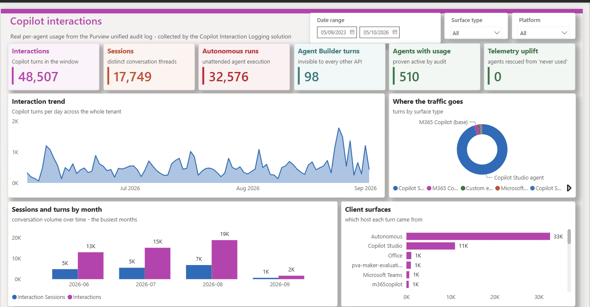</a><br><sub><i>Illustrative — demo environment; names fictitious; figures indicative only.</i></sub></p>

Ideas for a first report:

- **Interactions over time**, from **CreationDate** (once you store UTC dates; see [Data model](#data-model)).
- **Sessions**, counting distinct **Thread Id** values. Thread Id was populated on every row in the reference data, so it makes a better session key than **Conversation Id**.
- **Where people use Copilot**, by **App Host** and **AppIdentity**.
- **Agents**, by **Agent Id** and **Agent Platform**, joined to your own agent inventory.
- **Collection health**, from the run log and error rows, including days with no rows (see [Failure states and monitoring](#failure-states-and-monitoring)).

For a fuller example that combines this data with agent inventory from several platforms, see [Custom Agent Reporting – Architecture](https://github.com/RyanBowie/custom-agent-reporting-architecture).

## Failure states and monitoring

> [!IMPORTANT]
> **Run history is the source of truth.** **Flow State** in the run log is only ever Running or Finished, and the scheduled flow sets it to Finished after every page, so a run that later fails can still show Finished. Check the run's status in run history, and the error rows, rather than the run log.

| What you see | What it means | What to do |
| --- | --- | --- |
| Run **Succeeded** | Every page was read and every record was upserted, or the failures were logged as error rows | Check **Records Error** and the error rows |
| Run **Failed** with `CollectionIncomplete`, plus a "Collection incomplete" error row | The query never started, or pages were left unread | Read the error row, fix the cause and re-run the window with the manual flow |
| Run **Failed** with `GetLogsFailed` | An unhandled failure inside `Get_Logs`. The reference build writes no error row for it. | Find the failed action in run history, fix it and re-run the window |
| Run **Failed** with `KeyVaultSecretUnavailable`, plus an "Unbound Action call to AKV" error row | The Key Vault secret couldn't be read | See [option A](#option-a--azure-key-vault-recommended) |
| `QueryWaitTimeExceeded` | Meant to stop a run whose query didn't finish in time, but it never ran in testing, because a Do until loop that reaches its limit ends Succeeded | In your build, check the query's `status` after the wait loop and fail the run if it isn't `succeeded` |
| **Records Error** above 0, or "Upsert a row 2" error rows | Some records weren't saved | Fix the cause and re-run the window. The upsert fills the gaps. |
| Run **Failed** while the run log shows Finished | Expected in the scheduled flow, which sets Finished after every page | Trust the run status |

**Monitoring.** The reference build sends no alerts. Choose at least one:

- Turn on failure notification emails for the flow owner.
- Build an alert flow on [cloud flow run metadata](https://learn.microsoft.com/power-automate/dataverse/cloud-flow-run-metadata) in Dataverse.
- Use the monitoring in the [CoE Starter Kit](https://learn.microsoft.com/power-platform/guidance/coe/starter-kit).
- Add a "days with no rows" tile to your report.

Run history is kept for 28 days ([limits and configuration](https://learn.microsoft.com/power-automate/limits-and-config), [missing run history](https://learn.microsoft.com/troubleshoot/power-platform/power-automate/flow-run-issues/missing-runs-or-triggers-history-for-a-flow)), so record failures somewhere that lasts longer. For patterns, see [error handling in Power Automate](https://learn.microsoft.com/power-automate/guidance/coding-guidelines/error-handling). Every failure path is described in [Failure paths](docs/ACTION_REFERENCE.md#failure-paths), and known defects in [Known issues](docs/ACTION_REFERENCE.md#known-issues).

## Operations

**Missed days don't heal themselves.** The scheduled flow always collects the UTC day from four days ago. If a run fails, or the flow is off, that day is never collected again unless you back-fill it with the manual flow.

**Back-filling.** Run the manual flow with a StartDate and an EndDate in `YYYY-MM-DD` format.

- EndDate is exclusive. To collect 1 to 7 September, enter 1 September as StartDate and **8 September** as EndDate.
- Keep EndDate at least 48 hours in the past, so the audit records have arrived, and StartDate within the last 180 days, the retention period of Audit (Standard).
- Overlapping windows are safe. The upsert updates existing rows rather than duplicating them.
- The manual flow has the same 10-hour paging limit, so on a busy tenant back-fill a few days at a time. See [Planning for high volumes](docs/ACTION_REFERENCE.md#planning-for-high-volumes).
- During British Summer Time, the reference build's manual window starts and ends at 01:00 UTC, so it misses the first hour of StartDate. Start a day earlier, or apply the fix in [The manual flow](docs/ACTION_REFERENCE.md#the-manual-flow), which builds the window as `@{triggerBody()?['date']}T00:00:00Z`.

**Volume.** At the tested rate of about 25 to 60 records a minute, the 10-hour paging limit runs out at roughly 15,000 to 36,000 records a day. Above that, split the day into smaller windows. Don't turn on concurrency for the per-record loop: its counters are flow variables, and they become unreliable in parallel. See [Planning for high volumes](docs/ACTION_REFERENCE.md#planning-for-high-volumes).

**Time zone.** Store UTC in your build (see [Data model](#data-model)), and convert to local time in your report.

**Schedule.** The reference build's Recurrence trigger sets no start time or hour, so it runs at about the time of day the flow was turned on. In your build, set an hour, for example 02:00, so runs happen at a predictable time.

**Retention.** Schedule a [bulk deletion](https://learn.microsoft.com/power-platform/admin/delete-bulk-records) job that removes rows older than your agreed retention period.

**Rotating the secret.** Before the current secret expires:

1. Add a new client secret to the app registration.
2. Update the Key Vault secret (option A) or `poc_Audit_Secret` (option B) with the new **Value**.
3. Save both flows, or turn them off and on, so they pick up the change.
4. Run the manual flow over a short window to confirm it works.
5. Delete the old secret from the app registration.

**Auditing changes.** To record who changes the flows, environment variables and tables, turn on [Dataverse auditing](https://learn.microsoft.com/power-platform/admin/manage-dataverse-auditing) for the environment.

## Troubleshooting

| Symptom | Likely cause | Fix |
| --- | --- | --- |
| `AADSTS7000215` (invalid client secret) | The secret's ID was used instead of its **Value**, the secret has expired, or the Key Vault switch isn't exactly `true` and `poc_Audit_Secret` is empty | Check the value and expiry, and the [switch](#secret-handling-decision-how-the-client-secret-is-stored) |
| `AADSTS700016` (application not found) | Wrong client ID in `poc_Audit_AppRegID`, or wrong tenant in `poc_Audit_Tenant` | Copy both from the app registration's **Overview** page |
| 401 or 403 from Graph | `AuditLogsQuery.Read.All` is missing, or admin consent wasn't granted. `AuditLog.Read.All` isn't enough. | Add the permission and grant consent ([Graph permissions](docs/ACTION_REFERENCE.md#graph-permissions)) |
| Failed with `KeyVaultSecretUnavailable` | The Key Vault secret couldn't be read | Check the reference, the role assignments, the vault's network rules and the secret's expiry ([option A](#option-a--azure-key-vault-recommended)) |
| Failed with `CollectionIncomplete`, "Query started: no" | The query was never created, often because of an expired secret, missing consent or Conditional Access. The run takes a few minutes to fail, because the records loop still makes its five attempts. | Fix the cause in the error row, then re-run the window |
| Failed with `CollectionIncomplete`, "Pages left unread: yes" | The page cap or the 10-hour limit was reached, or a page couldn't be read | Re-run the window in smaller parts ([Failure paths](docs/ACTION_REFERENCE.md#failure-paths)) |
| The run succeeds but writes no rows | No Copilot activity in the window, auditing is off, or the records haven't arrived yet | Compare with a Purview Audit search for the same window, and keep windows at least 48 hours old |
| The flow is suspended or turned off | A data policy blocks HTTP and Dataverse together, the connection reference has no working connection, or the owner's licence has lapsed | Check the data policy, the connection and the licence |
| Times are an hour out | The reference build's British Summer Time defect | Store UTC ([Upsert mapping](docs/ACTION_REFERENCE.md#upsert-mapping)) |
| Graph returns 429 (too many requests) | Throttling. The retry loops wait a fixed time and don't read Retry-After. | Use smaller windows or run less often ([Limits and throttling](docs/ACTION_REFERENCE.md#limits-and-throttling)) |

## Limitations

- **Scope.** The query asks for records whose record type and operation are both `CopilotInteraction`: Microsoft 365 Copilot, Copilot Chat and Copilot Studio agents. It doesn't collect `ConnectedAIAppInteraction`, `AIAppInteraction`, Facilitator (`TeamCopilotInteraction`) or Copilot admin activity. See [Audit logs for Copilot and AI applications](https://learn.microsoft.com/purview/audit-copilot) and [What's collected and what isn't](docs/ACTION_REFERENCE.md#whats-collected-and-what-isnt).
- **Query wait.** If Graph takes longer than the wait loop's limit (8 hours in the scheduled flow, 3 hours in the manual flow), the loop still ends as Succeeded and the flow reads whatever the query returns. See [Loop limits](docs/ACTION_REFERENCE.md#loop-limits).
- **Record-count limit.** A query returns at most 1,000,000 records and can show `succeeded` when it stopped early. The reference build doesn't check `isRecordCountLimitExceeded`; your build should ([Limits and throttling](docs/ACTION_REFERENCE.md#limits-and-throttling)).
- **Run-history exposure.** Unless you secure the HTTP outputs and the per-record actions, run history shows raw audit records for 28 days. See [Securing run history](docs/ACTION_REFERENCE.md#securing-run-history), [secure inputs and outputs](https://learn.microsoft.com/power-automate/how-tos-use-sensitive-input) and [Microsoft's guidance](https://learn.microsoft.com/power-automate/guidance/coding-guidelines/use-secure-inputs-outputs-triggers).
- **Throughput.** Records are upserted one at a time, about 25 to 60 a minute in testing. Concurrency would shorten runs, but the counters rely on sequential processing ([control concurrency](https://learn.microsoft.com/power-automate/guidance/coding-guidelines/implement-parallel-execution#control-concurrency), [For each considerations](https://learn.microsoft.com/azure/logic-apps/logic-apps-control-flow-loops#for-each-loop-considerations)).
- **Power Platform request limits.** Each record costs about six requests, and up to nine. During the current transition period, a Premium licence allows 200,000 requests per cloud flow per 24 hours, roughly 20,000 to 30,000 records a day. Once the official per-user limit of 40,000 applies, that falls to roughly 4,000 to 6,000 records a day, and the limit is shared with the owner's other flows. Microsoft won't enforce the official limits until at least six months after Power Automate usage reporting is generally available. A Process licence gives the flow its own 250,000 requests, and you can stack them. Check usage in the Power Platform admin center under **Licensing** > **Power Automate** > **Usage**. Dataverse service protection limits apply separately. See [Request limits in Power Automate](https://learn.microsoft.com/power-platform/admin/api-request-limits-allocations#request-limits-in-power-automate), [what to do when a flow is throttled](https://learn.microsoft.com/power-automate/guidance/coding-guidelines/understand-limits#what-to-do-when-your-flow-is-throttled) and [Request limits](docs/ACTION_REFERENCE.md#request-limits).
- **Beta endpoint.** The flows call Microsoft Graph beta, which isn't supported in production. The v1.0 record-type enum has no `CopilotInteraction`, so a v1.0 build must filter by operation only, and needs validating. See [Switching to v1.0](docs/ACTION_REFERENCE.md#switching-to-v10).
- **One tenant, global cloud only.** The flows collect from the tenant that holds the app registration, in the global service.
- **Collector only.** The build includes no report, alerting or retention job. You build those.

## Origins and credit

This build is adapted from the audit log collection pattern in the [Microsoft Power Platform CoE Starter Kit](https://learn.microsoft.com/power-platform/guidance/coe/starter-kit), described in [Collect audit logs using an HTTP action with Microsoft Graph](https://learn.microsoft.com/power-platform/guidance/coe/setup-auditlog-http-graphapi). The kit is open source under the MIT licence at [github.com/microsoft/coe-starter-kit](https://github.com/microsoft/coe-starter-kit). Microsoft describes it as no longer actively maintained, with its core capabilities now in the Power Platform admin center. Credit for the original pattern belongs to the CoE Starter Kit team.

This build changes the pattern: it collects only `CopilotInteraction` records into their own table, logs every run and every failure, lets you choose Key Vault or a plain-text variable (not recommended) for the secret, fails the run loudly when collection is incomplete, and adds a manual back-fill flow. Some legacy actions and variables from earlier versions remain in the reference build and are labelled **Legacy** in the reference. It keeps the kit's HTTP actions for the Graph calls; for your own build, consider a [custom connector](#recommended-consider-a-custom-connector) instead. See [Origins and credit](docs/ACTION_REFERENCE.md#origins-and-credit).

## Related

- [Action reference](docs/ACTION_REFERENCE.md): every action in both flows, what it does and why it exists.
- [Documentation site](https://ryanbowie.github.io/copilot-interaction-logging/): this guide as a single page, with an architecture diagram, annotated screenshots and a build-from-scratch step tracker.
- [Custom Agent Reporting – Architecture](https://github.com/RyanBowie/custom-agent-reporting-architecture): a reference architecture for tenant-wide agent reporting that uses this build as its interaction-telemetry source.
- More community projects: [Power Platform Solution Reviewer](https://ryanbowie.github.io/copilot-studio-powerplatform-solution-reviewer-site/), [SharePoint Search Hub](https://ryanbowie.github.io/copilot-studio-sharepoint-search-hub/), [Power BI Agent](https://ryanbowie.github.io/copilot-studio-powerbi-agent/) and [Documentation Builder](https://ryanbowie.github.io/copilot-studio-documentation-builder/).
- Microsoft Purview: [Audit logs for Copilot and AI applications](https://learn.microsoft.com/purview/audit-copilot), [get started with auditing](https://learn.microsoft.com/purview/audit-get-started) and [auditing solutions](https://learn.microsoft.com/purview/audit-solutions-overview).

## Licence

[MIT](LICENSE). Provided as is, without warranty. You're responsible for assessing, operating and securing anything you build from this guide.

Microsoft, Microsoft 365, Copilot, Power Platform, Power Automate, Power BI, Dataverse, Entra, Purview, Sentinel, Defender and Azure are trademarks of the Microsoft group of companies. This project isn't affiliated with or endorsed by Microsoft.
