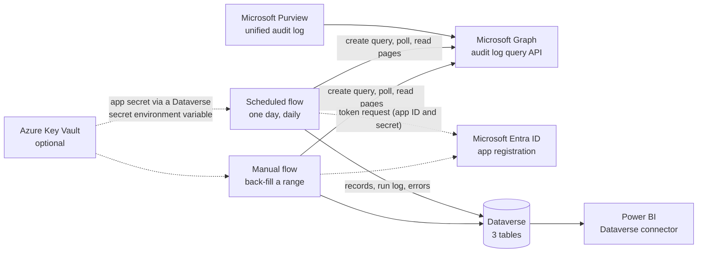
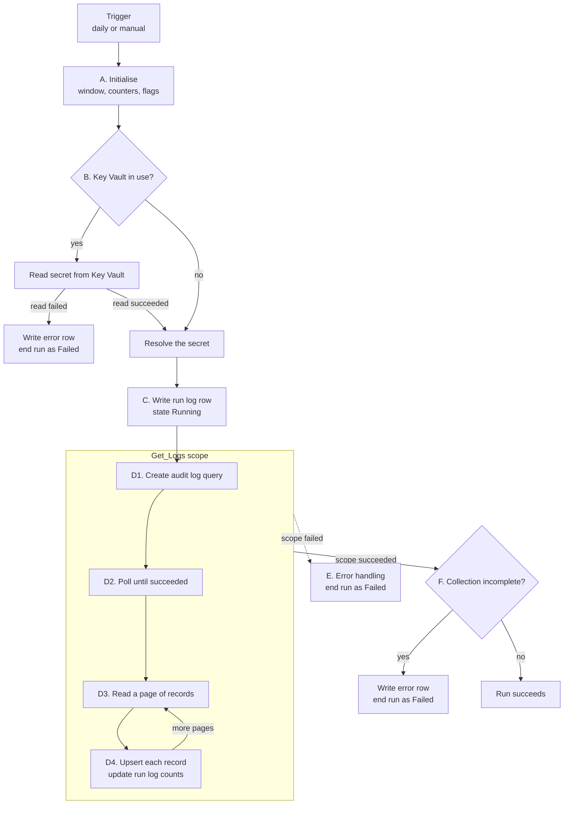
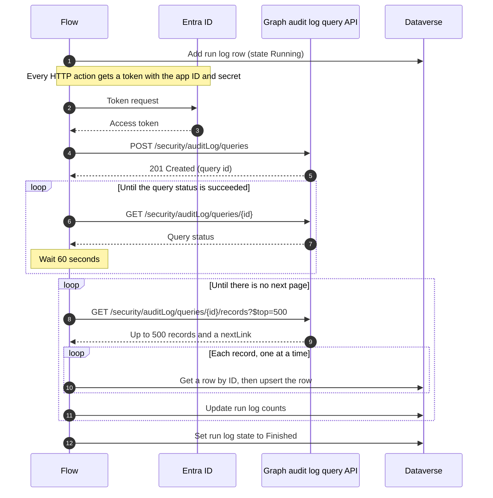

# Copilot interaction logging: flow action reference

**Community project. This is not a Microsoft product.** It is a personal project shared as-is under the [MIT licence](../LICENSE). Microsoft does not support it, and no SLA or warranty applies. Build and test in a non-production environment.

> [!IMPORTANT]
> **Documentation only.** No solution package, flow export or source code is published. This page describes a reference build action by action so that you can build your own.
>
> - **Tested** marks behaviour observed in a sandbox. **From the design (not live-tested)** marks behaviour that the flow definition implies but that was not exercised.
> - The reference build calls the Microsoft Graph **beta** audit log query API. For a new build, use v1.0 and validate it first. See [Switching to v1.0](#switching-to-v10).
> - Secret handling is your decision: Azure Key Vault (recommended) or a plain-text environment variable. Both paths are described below.

The build guide is in the [README](../README.md). This page explains **what every action does and why it exists**, so that you can rebuild the flows, simplify them, or troubleshoot your own version.

## At a glance

The build has two cloud flows that share the same design. The scheduled flow collects one day at a time. The manual flow back-fills a date range you choose.

| | Scheduled flow | Manual flow |
|---|---|---|
| Trigger | Recurrence, daily, time zone GMT Standard Time, no hour set | Manual button with **StartDate** and **EndDate** inputs |
| Window collected | One UTC day, from 4 days ago to 3 days ago (for example, a run on 10 March collects 6 March) | StartDate 00:00 to EndDate 00:00 (EndDate is exclusive; see [Known issues](#known-issues)) |
| Wait for the query | Up to 480 checks or 8 hours | Up to 300 checks or 3 hours |
| Pages of records | Up to 100 pages or 10 hours | Up to 1,000 pages or 10 hours |
| Run type written to the log | Scheduled | Manual |
| Run log set to Finished | After every page (see [Known issues](#known-issues)) | Once, after the last page |
| Actions (excluding the trigger) | 85 | 81 |

## Contents

- [How to read this reference](#how-to-read-this-reference)
- [Origins and credit](#origins-and-credit)
- [Architecture](#architecture)
- [Connectors and licensing](#connectors-and-licensing)
- [Phase A: Initialise](#phase-a-initialise)
- [Phase B: Resolve the Graph secret](#phase-b-resolve-the-graph-secret)
- [Phase C: Open the run log](#phase-c-open-the-run-log)
- [Phase D: Collect from Microsoft Graph](#phase-d-collect-from-microsoft-graph)
  - [D1: Create the audit log query](#d1-create-the-audit-log-query)
  - [D2: Wait for the query to finish](#d2-wait-for-the-query-to-finish)
  - [D3: Fetch a page of records](#d3-fetch-a-page-of-records)
  - [D4: Upsert each record](#d4-upsert-each-record)
- [Phases E and F: Error handling and completeness](#phases-e-and-f-error-handling-and-completeness)
- [HTTP authentication](#http-authentication)
- [Graph permissions](#graph-permissions)
- [Environment variables](#environment-variables)
- [Upsert mapping](#upsert-mapping)
- [Dataverse tables written by the flows](#dataverse-tables-written-by-the-flows)
- [The manual flow](#the-manual-flow)
- [Loop limits](#loop-limits)
- [Run-time behaviour](#run-time-behaviour)
- [Securing run history](#securing-run-history)
- [Graph notes](#graph-notes)
  - [Switching to v1.0](#switching-to-v10)
- [Failure paths](#failure-paths)
- [Known issues](#known-issues)
- [Clean-build checklist](#clean-build-checklist)
- [Licence and trademarks](#licence-and-trademarks)

## How to read this reference

- **Every action is listed.** The phase tables cover all 85 actions in the scheduled flow, plus the trigger, in designer order. [The manual flow](#the-manual-flow) lists only what differs.
- **Names are the reference build's internal names**, kept so that they match the screenshots. The designer shows them with spaces instead of underscores (for example, `Initialize_appID` appears as "Initialize appID"). Give actions meaningful names in your own build and [add notes to them](https://learn.microsoft.com/power-automate/use-peekcode-addnotes#add-notes). Rename actions before you reference them in expressions, because expressions refer to actions by name.
- **`poc` is the publisher prefix** of the reference build. Use your own prefix.
- **Run after.** Unless stated otherwise, an action runs after the previous action in its container succeeds. A non-default *run after* setting is shown in italics, for example *Runs after `AuditLogQuery` fails.*
- **Secure inputs** marks actions that have secure inputs (and outputs, where noted) turned on, so their values are hidden in run history.
- **Clean build** says what to do with the action in your own build:

| Label | Meaning |
|---|---|
| **Keep** | Needed. Build it as described. |
| **Change** | Needed, but build it differently. The reason is given. |
| **Optional** | Useful but not required. |
| **Legacy** | Inherited from an earlier version of the pattern and not used. Omit it. |

## Origins and credit

This build is adapted from the audit log collection pattern in the [Microsoft Power Platform CoE Starter Kit](https://learn.microsoft.com/power-platform/guidance/coe/starter-kit), described in [Collect audit logs using an HTTP action with Microsoft Graph](https://learn.microsoft.com/power-platform/guidance/coe/setup-auditlog-http-graphapi). The CoE Starter Kit is open source under the MIT licence at [github.com/microsoft/coe-starter-kit](https://github.com/microsoft/coe-starter-kit). Microsoft describes the kit as no longer actively maintained, with its core capabilities now available in the Power Platform admin center. Credit for the original pattern belongs to the CoE Starter Kit team.

The pattern is the same: an app registration, a scheduled flow that creates a Microsoft Graph audit log query, polls until it finishes, and pages through the results into Dataverse. This build changes it as follows:

- It collects only `CopilotInteraction` records and writes them to its own table.
- It logs every run (Copilot Interaction Flow Runs) and every failure (Copilot Interaction Flow Run Errors).
- It lets you choose between an Azure Key Vault secret and a plain-text environment variable for the app secret.
- It ends the run as **Failed** with a clear message when collection is incomplete, instead of finishing silently.
- It adds a manual flow to back-fill a date range.

**Legacy leftovers.** The reference build still contains actions, variables and environment variables from earlier versions of the pattern that nothing reads. They are listed in the tables with the **Legacy** label so that you can match them to the screenshots and leave them out:

- Composes `Compose_2`, `minutes_back`, `start_time_minutes_back` and `end_time_minutes_back`, and the two environment variables they read.
- Variables `theAppID`, `theTextSecret`, `Secret_AzureType`, `ContentIDs`, `NextPageUri`, `NextPageParamValue`, `AuditLogDaysOffset` and `emailGUID`.
- The always-true `UseGraphAPI` switch and its unreachable `Terminate`.
- The environment variable `Audit_ReviewerEmail`.
- Two condition names that echo the Office 365 Management Activity API: `DidAllListAuditLogContentCallsFailed_2` and `DidAllGetContentDetailsCallsFailed_2`. They work, but the names describe calls that this build doesn't make.

## Architecture

### Components

Purview records Copilot interactions in the unified audit log. The flows ask Microsoft Graph to run an audit log query for one window, wait for it to finish, then page through the results and upsert each record into Dataverse. Power BI (or any Dataverse client) reports from there.



### Control flow

Each run moves through six phases. Phases D1 to D4 sit inside one scope, `Get_Logs`, so that a single error handler can catch any failure in them.



### Sequence



<p align="center"><a href="images/flow-01-overview.png"></a><br><sub><i>Top level of the scheduled flow (variables collapsed). Reference build in the designer; includes legacy actions inherited from the CoE Starter Kit pattern that a clean build can omit.</i></sub></p>

### Phase map

| Phase | Top-level actions | What happens | Actions | Screenshot |
|---|---|---|---|---|
| [A](#phase-a-initialise) | `Compose_2` to `varRecordErrorCount` | Sets the collection window, counters and flags | 23 | `flow-02` |
| [B](#phase-b-resolve-the-graph-secret) | `EnvVarTextCheck`, `Check_AKV_Secret`, `Resolve_Graph_Secret` | Reads the app secret from Key Vault or from a plain-text environment variable | 8 | `flow-03` |
| [C](#phase-c-open-the-run-log) | `Capture_Flow_Run_Details` | Writes a Running row to Copilot Interaction Flow Runs | 2 | `flow-03` |
| [D1](#d1-create-the-audit-log-query) | `Get_Logs` | Creates the Graph audit log query, with retries | 16 | `flow-04` |
| [D2](#d2-wait-for-the-query-to-finish) | (inside `Get_Logs`) | Polls the query every 60 seconds until it succeeds | 5 | `flow-05` |
| [D3](#d3-fetch-a-page-of-records) | (inside `Get_Logs`) | Reads up to 500 records per page, with retries | 12 | `flow-06` |
| [D4](#d4-upsert-each-record) | (inside `Get_Logs`) | Upserts each record, then moves to the next page | 13 | `flow-07` |
| [E](#phases-e-and-f-error-handling-and-completeness) | `Error_Handling` | Ends the run as Failed if the `Get_Logs` scope failed | 3 | `flow-08` |
| [F](#phases-e-and-f-error-handling-and-completeness) | `Check_Collection_Complete` | Ends the run as Failed if data is missing or partial | 3 | `flow-08` |
| | | **Total** | **85** | |

## Connectors and licensing

| Connector or action | Used by | Notes |
|---|---|---|
| HTTP (built-in) | `AuditLogQuery`, `AuditLogQueryStatus`, `AuditLogRecords` | Premium. Authenticates to Graph with the app registration. No connection is needed. |
| Microsoft Dataverse | Run log, error rows, `Get_a_row_by_ID`, `Upsert_a_row_2`, `Perform_an_unbound_action` | Premium. Uses one connection reference. |
| Built-in actions | Variables, Compose, Condition, Scope, Do until, Apply to each, Delay, Parse JSON, Select, Terminate | No connector licence needed. |

Because the flows use premium connectors, the flow owner needs a licence that includes them, or the flows need a Process licence. Check [Types of Power Automate licences](https://learn.microsoft.com/power-platform/admin/power-automate-licensing/types) and the [licensing FAQ](https://learn.microsoft.com/power-platform/admin/power-automate-licensing/faqs) for current terms.

## Phase A: Initialise

Phase A sets the collection window and creates every variable the run uses. Power Automate requires variables to be initialised at the top level of a flow, before any scope, which is why they all sit here. Thirteen of the 23 actions are legacy and can be left out.

<p align="center"><a href="images/flow-02-variables.png"></a><br><sub><i>Trigger, legacy Composes and variable initialisers. Reference build in the designer; includes legacy actions inherited from the CoE Starter Kit pattern that a clean build can omit.</i></sub></p>

| Action | Type | What it does | Why it exists | Clean build |
|---|---|---|---|---|
| `Recurrence` | Trigger | Starts the flow once a day (frequency Day, interval 1, time zone GMT Standard Time). No start time or hour is set, so it runs at about the time of day the flow was turned on. | The window is a fixed UTC day, so the run time affects only when data arrives, not what is collected. | **Change.** Set an hour so runs are predictable. |
| `Compose_2` | Compose | Outputs `utcNow()`. Nothing reads it. | Left over from an earlier version. | **Legacy** |
| `minutes_back` | Compose | Outputs `mul(-1, min(60, Audit - Minutes to Look Back))`. Nothing reads it. | Earlier versions could run hourly over a rolling window measured in minutes. The descriptions on `startTime_variable` and `endTime_variable_` in the reference build still hold that hourly formula. | **Legacy** |
| `start_time_minutes_back` | Compose | Outputs `mul(-1, add(max(60, Audit - End Time Minutes Ago), Audit - Minutes to Look Back))`. Nothing reads it. | As above. | **Legacy** |
| `end_time_minutes_back` | Compose | Outputs `mul(-1, Audit - End Time Minutes Ago)`. Nothing reads it. | As above. | **Legacy** |
| `Initialize_appID` | Initialize variable | Creates `theAppID` (string, empty). Nothing reads it. | The HTTP actions read the app ID from the `Audit_AppRegID` environment variable instead. | **Legacy** |
| `Initialize_variable` | Initialize variable | Creates `UseGraphAPI` (boolean, `true`). Only the `UseGraphAPI` condition reads it, so that condition is always true. | Mirrors the CoE Starter Kit's [Audit Logs - Use Graph API](https://learn.microsoft.com/power-platform/guidance/coe/setup-auditlog-http-graphapi) switch, which chooses between Graph and the legacy Office 365 Management API. This build only uses Graph. | **Legacy** (remove with the condition) |
| `Initialize_theTextSecret` | Initialize variable | Creates `theTextSecret` (string, empty). Nothing reads it. | Left over from an earlier secret design. | **Legacy** |
| `Initialize_Secret_AzureType_to_true` | Initialize variable | Creates `Secret_AzureType` (boolean, `true`). Nothing reads it. | As above. | **Legacy** |
| `AuditLogQueryID` | Initialize variable | Creates `AuditLogQueryID` (string, empty). It receives the id of the Graph query once the query is created. | Used to poll the query, to build the records URL, and by the completeness check ("query started"). | **Keep** |
| `AuditLogQueryRecordsURL` | Initialize variable | Creates `AuditLogQueryRecordsURL` (string, null). It holds the URL of the next page of records, and is empty when there are no more pages. | Drives the paging loop, and tells the completeness check whether pages were left unread. | **Keep** |
| `ContentIDs` | Initialize variable | Creates `ContentIDs` (array, empty). Nothing reads it. | Left over from the Management Activity API version. | **Legacy** |
| `NextPageUri` | Initialize variable | Creates `NextPageUri` (string, null). Nothing reads it. | As above. | **Legacy** |
| `NextPageParamValue` | Initialize variable | Creates `NextPageParamValue` (string, null). Nothing reads it. | As above. | **Legacy** |
| `AuditLogDaysOffset` | Initialize variable | Creates `AuditLogDaysOffset` (integer, empty). Nothing reads it. | As above. | **Legacy** |
| `startTime_variable` | Initialize variable | Creates `startTime` as midnight UTC four days ago: `formatDateTime(startOfDay(addDays(utcNow(), -4)), 'yyyy-MM-ddTHH:mm:ss.0000000Z')`. | Start of the window. Audit records can arrive late, so the flow collects a day that is at least three days old. | **Keep** |
| `endTime_variable_` | Initialize variable | Creates `endTime` as midnight UTC three days ago (the same expression with `-3`). The end is exclusive. | End of the window, giving exactly one UTC day with no gaps or overlaps between daily runs. | **Keep** |
| `emailGUID` | Initialize variable | Creates `emailGUID` (string, empty). Nothing reads it. | Left over from an earlier version. | **Legacy** |
| `httpCallFailed` | Initialize variable | Creates `httpCallFailed` (boolean, `false`). Set to `true` when an HTTP attempt fails, and back to `false` when one succeeds. | After each retry loop, a condition reads it to decide whether to carry on. | **Keep** |
| `httpCallFailureCount` | Initialize variable | Creates `httpCallFailureCount` (integer, 0). Counts retry loops that ended with a failed call. | Reported in the completeness error ("failed Graph calls"). | **Keep** |
| `varUpsertedCount` | Initialize variable | Creates `varUpsertedCount` (integer, no initial value). Counts successful upserts. | Written to **Records Retrieved** in the run log. | **Change.** Initialise to 0. |
| `varCreatedCount` | Initialize variable | Creates `varCreatedCount` (integer, no initial value). Counts records that weren't already in Dataverse. | Written to **Records Created**. | **Change.** Initialise to 0. |
| `varModifiedCount` | Initialize variable | Creates `varModifiedCount` (integer, no initial value). Counts records that were already in Dataverse. | Written to **Records Modified**. | **Change.** Initialise to 0. |
| `varRecordErrorCount` | Initialize variable | Creates `varRecordErrorCount` (integer, no initial value). Counts failed upserts. | Written to **Records Error**. | **Change.** Initialise to 0. |

> [!NOTE]
> Microsoft Purview says audit records are typically available 60 to 90 minutes after an event, but doesn't commit to a time. See [Before you search the audit log](https://learn.microsoft.com/purview/audit-search#before-you-search-the-audit-log). The three-day lag is a generous buffer, not a documented requirement. If you shorten it, compare counts against a later re-run of the same window before you rely on it.

## Phase B: Resolve the Graph secret

The HTTP actions need the client secret of the app registration. Phase B decides where that secret comes from, based on the `Audit_UsingAKVtruefalse` environment variable:

- **`true`:** the secret is read from Azure Key Vault through a Dataverse environment variable of type **Secret** (`KeyVaultSecret`). The secret value never appears in an environment variable or solution file.
- **Anything else (default `false`):** the secret is taken from the plain-text environment variable `Audit_Secret`. This is simpler to set up, but anyone who can read environment variables in the environment can read the secret.

Which option to use is your decision. The README explains the trade-offs. Only the plain-text path was live-tested in the reference build. Validate the Key Vault path in your sandbox, and see [Use Azure Key Vault secrets](https://learn.microsoft.com/power-apps/maker/data-platform/environmentvariables-azure-key-vault-secrets#create-a-power-automate-flow-to-test-the-environment-variable-secret) for the prerequisites.

<p align="center"><a href="images/flow-03-secret-and-runlog.png"></a><br><sub><i>Secret resolution and run log. Reference build in the designer; includes legacy actions inherited from the CoE Starter Kit pattern that a clean build can omit.</i></sub></p>

| Action | Type | What it does | Why it exists | Clean build |
|---|---|---|---|---|
| `EnvVarTextCheck` | Compose | Outputs the value of `Audit_UsingAKVtruefalse`. | Shows the switch value in run history, and gives the condition a single input. | **Optional.** The condition can read the environment variable directly. |
| `Check_AKV_Secret` | Condition | Checks whether `EnvVarTextCheck` equals `true`. The **False** branch is empty. | Runs the Key Vault read only when Key Vault is in use. | **Keep** |
| `Perform_an_unbound_action` | Dataverse: Perform an unbound action (secure inputs and outputs) | **True** branch. Calls the Dataverse action `RetrieveEnvironmentVariableSecretValue` with `EnvironmentVariableName` = `poc_KeyVaultSecret`. Returns the secret in `EnvironmentVariableSecretValue`. | This is how a flow reads a Key Vault secret through a Secret-type environment variable. Secure inputs and outputs keep the value out of run history. | **Keep** if you use Key Vault |
| `Add_a_new_row` | Dataverse: Add a new row | *Runs after `Perform_an_unbound_action` fails or times out.* Writes an error row with Primary Detail "Failed - Unbound Action call to AKV - {time}" and an Error Reason that lists what to check: the environment variable, permissions, network rules and secret expiry. | Records why the run stopped, in a table that admins can review. No run log row exists yet at this point. | **Keep** if you use Key Vault |
| `Terminate_2` | Terminate | *Runs after `Add_a_new_row` succeeds or fails.* Ends the run as **Failed** with code `KeyVaultSecretUnavailable` and the message "Could not read the Graph app secret from Azure Key Vault (poc_KeyVaultSecret). Check the environment variable value, Key Vault permissions, network rules and secret expiry. Details in Copilot Interaction Flow Run Errors." | Stops before any Graph call is made without a secret. Running after both outcomes means the run stops even if the error row can't be written. | **Keep** if you use Key Vault |
| `CheckVariableAKV` | Compose | *Runs only when `Terminate_2` is skipped*, which means the Key Vault read succeeded. Outputs `Audit_UsingAKVtruefalse`. Nothing reads it. | Marks the successful Key Vault path in run history. | **Legacy** |
| `UsingAKVCheckValue` | Compose (secure inputs) | Repeats the expression in `Resolve_Graph_Secret`. Nothing reads it. | An earlier place for the secret, before `Resolve_Graph_Secret` was added at the top level. | **Legacy** |
| `Resolve_Graph_Secret` | Compose (secure inputs) | Outputs the secret: `if(equals(Audit_UsingAKVtruefalse, 'true'), <Key Vault value from Perform_an_unbound_action>, Audit_Secret)`. | The single source of the secret for all three HTTP actions, so the choice is made in one place. | **Keep** |

> [!TIP]
> Enter `true` exactly, in lower case with no spaces. A value that doesn't match, such as `yes` or `true` with a trailing space, silently selects the plain-text path. A clean build can normalise the value with `toLower(trim(...))` to remove that risk.

## Phase C: Open the run log

Phase C writes one row to **Copilot Interaction Flow Runs** before any data is collected. Phase D updates the same row with record counts as it goes.

| Action | Type | What it does | Why it exists | Clean build |
|---|---|---|---|---|
| `Capture_Flow_Run_Details` | Scope | Contains `Create_Flow_Run_Log`. `Get_Logs` runs only if this scope succeeds. | Groups the run log step. If the row can't be written (for example, the flow's connection has no access to the table), the run fails here before calling Graph. | **Optional.** A single action works too. |
| `Create_Flow_Run_Log` | Dataverse: Add a new row | Adds a row with: **Name** "CopilotInteraction \| Audit Logs \| Sync Audit Logs to Dataverse (v1) \| {utcNow}", **Audit Query Start Date** = `startTime`, **Audit Query End Date** = `endTime`, **Flow Start Date and Time** = `utcNow()`, **Flow State** = Running, **Run Type** = Scheduled. | Records every run and its window, even if collection later fails. Later actions update this row through its ID. | **Keep.** Also store the flow run ID (`workflow()?['run']?['name']`) so you can find the run in history. |

## Phase D: Collect from Microsoft Graph

Phase D does the work. Everything sits inside the `Get_Logs` scope, so that one handler ([Phase E](#phases-e-and-f-error-handling-and-completeness)) catches any unhandled failure. Inside it, the always-true `UseGraphAPI` condition holds two scopes that run one after the other:

- **`Scope-AuditLogQuery`** creates the audit log query (D1) and waits for it to finish (D2).
- **`Scope-AuditLogRecords`** runs if the first scope succeeds. It reads pages of records (D3) and upserts each record (D4).

Each Graph call sits inside a small **retry loop**. This pattern is inherited from the CoE Starter Kit and appears twice:

1. A Do until loop repeats the HTTP call until it returns the expected status code, up to a count and time limit.
2. If the call fails, a failure scope waits, then sets `httpCallFailed` to `true`. If it succeeds, the failure scope is skipped and a second action sets `httpCallFailed` to `false`.
3. After the loop, a condition reads `httpCallFailed`. If the last attempt failed, it adds 1 to `httpCallFailureCount` and skips the work that depends on the call. If not, the flow carries on.

The HTTP actions also have the platform's default retry policy, which retries timeouts (408), throttling (429) and server errors (5xx) with exponential back-off. Authentication errors such as 401 aren't retried by the policy, but the loop still makes five attempts. See [Retry policies](https://learn.microsoft.com/azure/logic-apps/error-exception-handling#retry-policies).

### D1: Create the audit log query

<p align="center"><a href="images/flow-04-create-query.png"></a><br><sub><i>Creating the audit log query. Reference build in the designer; includes legacy actions inherited from the CoE Starter Kit pattern that a clean build can omit.</i></sub></p>

| Action | Type | What it does | Why it exists | Clean build |
|---|---|---|---|---|
| `Get_Logs` | Scope | *Runs after `Capture_Flow_Run_Details` succeeds.* Contains all of Phase D. | Phase E runs if this scope fails, and Phase F runs if it succeeds. | **Keep** |
| `UseGraphAPI` | Condition | Checks whether the `UseGraphAPI` variable is `true`. It always is, so the **True** branch always runs. | In the CoE Starter Kit pattern, this switch chooses between Graph and the legacy Office 365 Management API. This build only uses Graph. | **Legacy.** Place the two scopes directly in `Get_Logs`. |
| `Terminate` | Terminate | **False** branch of `UseGraphAPI`. Ends the run as **Cancelled**. It can't be reached. | As above. | **Legacy** |
| `Scope-AuditLogQuery` | Scope | Contains D1 and D2. | `Scope-AuditLogRecords` runs only if this scope succeeds. | **Keep** |
| `ResetHttpCallFailed_2` | Set variable | Sets `httpCallFailed` to `false`. | Starts the retry pattern from a clean state. | **Keep** |
| `RetryLogic-StartAuditLogQuery` | Do until | Repeats until `AuditLogQuery` returns status code **201**. Limits: 5 attempts or 5 minutes. | Retries query creation after a transient failure. | **Keep** |
| `AuditLogQuery` | HTTP (secure inputs) | Sends `POST https://graph.microsoft.com/beta/security/auditLog/queries` with the body shown below. Returns **201 Created** with the query id. Authenticates with the app registration (see [HTTP authentication](#http-authentication)). | Asks Purview, through Graph, to run an audit search for one window, for Copilot interactions only. Secure inputs hide the secret in run history. | **Change.** Use v1.0 (see [Switching to v1.0](#switching-to-v10)). |
| `AuditLogQuery-FAILED` | Scope | *Runs after `AuditLogQuery` fails.* Contains `Delay_2` and `SetHttpCallFailed-TRUE_2`. | Handles the failure, so the loop can try again and the run doesn't stop. | **Keep** |
| `Delay_2` | Delay | Waits 20 seconds. | Gives a transient problem time to clear before the next attempt. | **Keep** |
| `SetHttpCallFailed-TRUE_2` | Set variable | Sets `httpCallFailed` to `true`. | Records that the latest attempt failed. | **Keep** |
| `SetHttpCallFailed-FALSE_2` | Set variable | *Runs only when `AuditLogQuery-FAILED` is skipped*, which happens when the call succeeds (or times out; see [Failure paths](#failure-paths)). Sets `httpCallFailed` to `false`. | Records that the latest attempt succeeded. | **Keep** |
| `DidAllListAuditLogContentCallsFailed_2` | Condition | Checks whether `httpCallFailed` is `true`, which means every attempt failed. | Decides whether there is a query to wait for. | **Keep.** Rename it, for example "Did query creation fail". |
| `Increment_variable_2` | Increment variable | **True** branch. Adds 1 to `httpCallFailureCount`. | Feeds the completeness check. `AuditLogQueryID` stays empty, so Phase F reports "query started: no". | **Keep** |
| `ParseBody_2` | Parse JSON | **False** branch. Parses the body of `AuditLogQuery`. | Makes the query `id` available to later actions. | **Keep.** Regenerate the schema for v1.0, and keep the `required` list short. |
| `Set-AuditLogQueryID` | Set variable | Sets `AuditLogQueryID` to the `id` from `ParseBody_2`. | Used to poll the query and build the records URL. | **Keep** |
| `Set-InitialAuditLogQueryRecordsURL` | Set variable | Sets `AuditLogQueryRecordsURL` to `https://graph.microsoft.com/beta/security/auditLog/queries/{AuditLogQueryID}/records?$top=500`. | The URL of the first page of results. Later pages come from `@odata.nextLink`. | **Change.** Use v1.0, and validate `$top` or omit it. |

The `AuditLogQuery` request body is:

```json
{
  "filterStartDateTime": "@{variables('startTime')}",
  "filterEndDateTime": "@{variables('endTime')}",
  "recordTypeFilters": ["CopilotInteraction"],
  "operationFilters": ["CopilotInteraction"]
}
```

<p align="center"><a href="images/panel-create-query.png"></a><br><sub><i>HTTP action in the reference build (beta endpoint shown; use v1.0 for a new build).</i></sub></p>

### D2: Wait for the query to finish

A Graph audit log query runs in the background. Its `status` moves through values such as `notStarted`, `running` and `succeeded`, or ends as `failed` or `cancelled`. The flow polls until the status is `succeeded`.

<p align="center"><a href="images/flow-05-poll-query.png"></a><br><sub><i>Polling the query. Reference build in the designer; includes legacy actions inherited from the CoE Starter Kit pattern that a clean build can omit.</i></sub></p>

| Action | Type | What it does | Why it exists | Clean build |
|---|---|---|---|---|
| `WaitUntilQueryFinished` | Do until | Repeats until `ParseBody-QueryStatus` reports `status` = `succeeded`. Limits: 480 checks or 8 hours (manual flow: 300 checks or 3 hours). | Records can be read only after the query succeeds. Large windows can take a long time. | **Change.** Also exit on `failed` or `cancelled`, then fail the run unless the status is `succeeded`. |
| `AuditLogQueryStatus` | HTTP (secure inputs) | Sends `GET https://graph.microsoft.com/beta/security/auditLog/queries/{AuditLogQueryID}`. It also sends a `Content-Type: application/json` header, which a GET doesn't need. | Reads the query's current status. | **Change.** Use v1.0, and drop the header. |
| `ParseBody-QueryStatus` | Parse JSON | Parses the status response. | Makes `status` available to the loop condition. | **Keep.** Regenerate the schema for v1.0. |
| `WaitBeforeCheckingStatusAgain` | Delay | Waits 60 seconds. | Avoids polling Graph too often. | **Keep** |
| `QueryWaitTimeExceeded` | Terminate | *Runs after `WaitUntilQueryFinished` has the status **TimedOut**.* Ends the run as **Failed** with the message "Audit Log query wait time exceeded". | Intended to stop the run when the query takes too long. | **Change.** It never runs; see the note below. |

> [!WARNING]
> **`QueryWaitTimeExceeded` never runs.** Tested with a mock flow that reproduces the run-after pattern: a Do until that reaches its count limit *or* its timeout ends with the status **Succeeded**, and the flow moves on. Nothing ends **TimedOut**, so this action is always skipped. Logic Apps documents a `FailWhenLimitsReached` option; validate it before relying on it. See [Until loop considerations](https://learn.microsoft.com/azure/logic-apps/logic-apps-control-flow-loops#until-loop-considerations).
>
> The records URL is set before this loop starts. If the loop stops before the query has succeeded (for example, because the query failed, which this loop doesn't check for), the flow goes on to read records from an unfinished query. What Graph returns in that case isn't documented, so the completeness check in Phase F may not catch it (from the design, not live-tested). A clean build should check `status` after the loop and fail the run unless it's `succeeded`.

### D3: Fetch a page of records

`Scope-AuditLogRecords` runs once `Scope-AuditLogQuery` succeeds. Its outer loop, `ProcessAuditLogRecords`, makes one pass per page: D3 reads the page and D4 writes its records. Each page holds up to 500 records and, if more remain, an `@odata.nextLink` with the URL of the next page (see [Paging Microsoft Graph data](https://learn.microsoft.com/graph/paging)). D4 copies that link into `AuditLogQueryRecordsURL`. The last page has no link, so the variable becomes empty and the loop ends (tested: 550 records over two pages).

Reading a page uses the same retry pattern as D1, with a 30-second wait and up to 5 attempts or 10 minutes.

<p align="center"><a href="images/flow-06-fetch-page.png"></a><br><sub><i>Fetching a page of records. Reference build in the designer; includes legacy actions inherited from the CoE Starter Kit pattern that a clean build can omit.</i></sub></p>

| Action | Type | What it does | Why it exists | Clean build |
|---|---|---|---|---|
| `Scope-AuditLogRecords` | Scope | *Runs after `Scope-AuditLogQuery` succeeds.* Contains D3 and D4. | Reads records only after the query step. That step also succeeds when query creation failed, because its retry pattern handles the failure (see the first note below). | **Keep** |
| `ProcessAuditLogRecords` | Do until | Repeats until `AuditLogQueryRecordsURL` is empty: `equals(length(variables('AuditLogQueryRecordsURL')), 0)`. Limits: 100 passes or 10 hours, so a scheduled run reads at most 100 pages, or 50,000 records at 500 a page (manual flow: 1,000 passes or 10 hours). | One pass per page. D1 sets the URL of the first page, and D4 sets each later one. | **Change.** Skip it when `AuditLogQueryID` is empty, and size the limits for your volumes (see [Loop limits](#loop-limits)). |
| `RetryLogic-AuditLogRecords` | Do until | Repeats until `AuditLogRecords` returns status code **200**. Limits: 5 attempts or 10 minutes. | Retries a page read after a transient failure. | **Keep** |
| `AuditLogRecords` | HTTP (secure inputs) | Sends `GET {AuditLogQueryRecordsURL}` with no headers. The first URL ends in `/records?$top=500`. Later URLs are the `@odata.nextLink` values that Graph returns. | Reads one page of audit records. Secure inputs hide the secret in run history. | **Change.** Use v1.0 for the first URL (set in D1). Consider secure outputs too, because the response holds user names, IP addresses and file names (see [Securing run history](#securing-run-history)). |
| `Compose_1` | Compose | *Runs after `AuditLogRecords` fails (but not when it times out).* Outputs the response body of the failed call. | Starts the failure scope. It reads the outputs of `AuditLogRecords`, which has secure inputs, so Microsoft's rules hide its value in run history (see [Securing run history](#securing-run-history)). Look for the Graph error in the outputs of `AuditLogRecords` instead. From Microsoft's documented rules; validate in your sandbox. | **Optional.** Run the failure scope directly after the HTTP action fails **or times out**. |
| `AuditLogRecords-FAILED` | Scope | *Runs after `Compose_1` succeeds.* Contains `AuditLogRecords-Wait` and `SetHttpCallFailed-TRUE-2_2`. | Handles the failure, so the loop can try again and the run doesn't stop. | **Keep** |
| `AuditLogRecords-Wait` | Delay | Waits 30 seconds. | Gives a transient problem time to clear before the next attempt. | **Keep** |
| `SetHttpCallFailed-TRUE-2_2` | Set variable | Sets `httpCallFailed` to `true`. | Records that the latest attempt failed. | **Keep** |
| `SetHttpCallFailed-FALSE-2_2` | Set variable | *Runs only when `AuditLogRecords-FAILED` is skipped*, which happens when the call succeeds (or times out; see the notes below). Sets `httpCallFailed` to `false`. | Records that the latest attempt succeeded. | **Keep** |
| `DidAllGetContentDetailsCallsFailed_2` | Condition | Checks whether `httpCallFailed` is `true`, which means the last attempt failed. It runs when the retry loop ends, including when the loop reaches its limits, because a Do until that reaches its limits still ends as Succeeded. | Decides whether there is a page to process. | **Keep.** Rename it, for example "Did page read fail". |
| `IncrementHttpCallFailureCount_2` | Increment variable | **True** branch. Adds 1 to `httpCallFailureCount`. The URL isn't changed, so the next pass reads the same page again. | Feeds the completeness check ("failed Graph calls"). | **Change.** Also set a flag that ends `ProcessAuditLogRecords`. Leave the URL as it is, so that Phase F reports pages left unread. |
| `ParseBody-AuditLogRecords` | Parse JSON | **False** branch. Parses the page (`body('AuditLogRecords')`). The schema lists `@odata.context`, `@odata.count`, `@odata.nextLink` and `value`, the array of records. | Gives D4 the records and the link to the next page, and makes their properties available as dynamic content in the designer. | **Change.** Relax the schema (see the warning below). |

> [!NOTE]
> **When query creation failed (tested).** If every attempt in D1 failed, `AuditLogQueryID` and `AuditLogQueryRecordsURL` are still empty. D3 sends a GET with an empty URL, which fails on all five attempts. `ProcessAuditLogRecords` then stops after one pass because the URL is empty, and Phase F reports "query started: no". With an invalid secret, the whole run took about 4.5 minutes. A clean build should skip D3 when there's no query ID.

> [!WARNING]
> **A page that can't be read is retried until the loop limits.** From the design (not live-tested): if all five attempts to read a page fail, for example because of an authentication or permission problem part-way through a run, the URL isn't changed and the next pass reads the same page again. Each pass takes at least 2.5 minutes, so the scheduled flow keeps trying for about 4 to 5 hours (100 passes), and the manual flow for up to 10 hours. Phase F then reports the collection as incomplete. A clean build should stop paging after a page fails all its attempts.

> [!NOTE]
> **A call that times out is treated as a success.** From the design (not live-tested): `Compose_1` runs only when `AuditLogRecords` *fails*. If the call ends as **TimedOut** instead, `Compose_1` and the failure scope are skipped, `httpCallFailed` is set to `false` and there's no 30-second wait. The retry loop still tries again, because the status code isn't 200. If the last attempt times out, the flow tries to parse a page it didn't receive, D4 doesn't run, and the next pass reads the same page again. Include **has timed out** in the run after settings of every failure path (see [Failure paths](#failure-paths)).

> [!WARNING]
> **The Parse JSON schema can stall paging.** The schema marks 13 properties of each record as required: `id`, `createdDateTime`, `auditLogRecordType`, `operation`, `organizationId`, `userType`, `userId`, `service`, `objectId`, `userPrincipalName`, `clientIp`, `administrativeUnits` and `auditData`. All except `objectId` and `clientIp` also have a type, so they can't be `null`. If any record on a page is missing one of these properties, or has `null` in a typed one, Parse JSON fails. D4 is skipped, the URL isn't advanced, and the same page is read again until the loop limits (from the design, not live-tested).

A permissive schema avoids this. Mark only `id` as required, and leave other properties untyped, or allow `null` with `"type": ["string", "null"]`. Paste it into the **Schema** box of the Parse JSON action, and validate it in your sandbox against a page from your own tenant:

```json
{
  "type": "object",
  "properties": {
    "@odata.nextLink": { "type": "string" },
    "value": {
      "type": "array",
      "items": {
        "type": "object",
        "properties": {
          "id": { "type": "string" },
          "userPrincipalName": {},
          "auditData": {}
        },
        "required": ["id"]
      }
    }
  }
}
```

### D4: Upsert each record

D4 runs on the **False** branch of `DidAllGetContentDetailsCallsFailed_2`, after the page has been parsed. `For_each_1` takes the records on the page one at a time. For each record, it checks whether the row already exists, builds a list of the resources Copilot accessed, and upserts the row with the audit record's `id` as the row's ID. After the loop, the flow moves on to the next page and saves the counts to the run log.

Because the row ID comes from the record, running the same window again updates the existing rows instead of creating duplicates (tested: a re-run of one day created 0 rows and modified 550). Microsoft notes that you can upsert with primary key values, although alternate keys are the more common choice for data integration. See [Use Upsert to create or update a record](https://learn.microsoft.com/power-apps/developer/data-platform/use-upsert-insert-update-record). In the records tested, `id` is a GUID, so it can be the row's primary key directly and the table needs no alternate key.

<p align="center"><a href="images/flow-07-per-record-upsert.png"></a><br><sub><i>Processing a page. Reference build in the designer; includes legacy actions inherited from the CoE Starter Kit pattern that a clean build can omit.</i></sub></p>

| Action | Type | What it does | Why it exists | Clean build |
|---|---|---|---|---|
| `For_each_1` | Apply to each | Loops over `value`, the records on the page. Concurrency isn't set, so records are processed one at a time. | Each record needs its own Dataverse calls. Processing one at a time keeps the counters accurate (see the tip below). | **Keep.** Set concurrency explicitly to 1. |
| `Get_a_row_by_ID` | Dataverse: Get a row by ID | Looks for a row in Copilot Interactions whose ID is the record's `id`. Its output isn't used. For a new record it fails with "not found", which is expected and doesn't fail the run, but it shows as a failed action in run history. | The upsert response doesn't say whether it created or updated a row (see [Use Web API](https://learn.microsoft.com/power-apps/developer/data-platform/use-upsert-insert-update-record#use-web-api)), so this lookup is how the flow counts new and existing records. | **Optional.** Keep it only if you want the created and modified counts. It adds one Dataverse request per record. |
| `Increment_variable_4` | Increment variable | *Runs after `Get_a_row_by_ID` fails or times out.* Adds 1 to `varCreatedCount`. | A failed lookup is taken to mean a new record. Any other failure, such as throttling, is also counted as created, so treat the count as an estimate. | **Optional**, with `Get_a_row_by_ID`. Rename it, for example "Count new record". |
| `Increment_variable_5` | Increment variable | *Runs after `Get_a_row_by_ID` succeeds.* Adds 1 to `varModifiedCount`. | The row already exists, so the upsert updates it. | **Optional**, with `Get_a_row_by_ID`. Rename it, for example "Count existing record". |
| `Select_Resource_Names` | Select | *Runs after `Increment_variable_4` and `Increment_variable_5` succeed or are skipped.* One of the two always runs. **From** is the record's `AccessedResources`, or an empty array if it has none. **Map** is each resource's `Name`, or its `Type` if it has no name, or an empty string. The output is an array of strings. | Reduces each resource to a readable name for the **Resources** column. Select is an action, not an expression function, so an inline `select()` expression fails with an error that the function isn't defined. | **Keep** |
| `Compose_Resources` | Compose | Outputs `join(union(body('Select_Resource_Names'), json('[]')), '; ')`: the names without duplicates, separated by semicolons. | [`union`](https://learn.microsoft.com/azure/logic-apps/expression-functions-reference#union) returns the items with no duplicates. Building the text once means the upsert's length check doesn't build it three times. | **Keep** |
| `Upsert_a_row_2` | Dataverse: Upsert a row | Upserts a row in Copilot Interactions. **Row ID** is the record's `id`, and 17 columns are mapped from the record (see [Upsert mapping](#upsert-mapping)). **Resources** is cut to 4,000 characters if it's longer. | Creates the row the first time a record is seen and updates it on any later run, in one call. The **Resources** column holds at most 4,000 characters, and a longer value would fail the upsert. | **Keep.** Store times in UTC (see [Known issues](#known-issues)). |
| `Add_a_new_row_2` | Dataverse: Add a new row | *Runs after `Upsert_a_row_2` fails or times out.* Adds a row to Copilot Interaction Flow Run Errors with Primary Detail "Failed - Upsert a row 2 - {time}", **Error Date** and **Error Date and Time** set to `utcNow()`, and a fixed Error Reason: "Upsert a new row 2 failed in the for each 1 > DidAllGetContentDetailsCallsFailed > Scope-AuditLogRecords." | Records the failure without stopping the loop, so the other records on the page are still written. | **Change.** Include the record `id`, the flow run ID and the error message from the upsert's output, and link the row to the run log. |
| `Increment_variable_1` | Increment variable | *Runs after `Add_a_new_row_2` succeeds.* Adds 1 to `varRecordErrorCount`. | Written to **Records Error** in the run log. | **Change.** Also run it when the error row can't be written, so the count stays right. |
| `Increment_UpsertedCount` | Increment variable | *Runs after `Upsert_a_row_2` succeeds.* Adds 1 to `varUpsertedCount`. | Written to **Records Retrieved** in the run log, although it counts records written, not records read. | **Change.** Count records read separately, for example by adding the length of `value` once per page. |
| `Set-AuditLogQueryRecordsURL` | Set variable | *Runs only after `For_each_1` succeeds.* Sets `AuditLogQueryRecordsURL` to the page's `@odata.nextLink`. The last page has no link, so the variable becomes empty and `ProcessAuditLogRecords` ends. | Moves on to the next page. | **Change.** Also run it when `For_each_1` fails, so that one bad record doesn't stall paging (see the warning below). |
| `Add_Records_Retrieved_to_Flow_Log` | Dataverse: Update a row | *Runs after `Set-AuditLogQueryRecordsURL` succeeds or is skipped.* Updates the run log row, using the ID returned by `Create_Flow_Run_Log`. Sets **Flow State** to Running, and **Records Created**, **Records Modified**, **Records Error** and **Records Retrieved** from the four counters. | Shows progress page by page on a long run. Because it also runs after a skip, the counts are saved even when the page didn't finish. | **Keep** |
| `Set_Copilot_Interaction_Flow_Run_Log_to_Finished` | Dataverse: Update a row | Runs after `DidAllGetContentDetailsCallsFailed_2`, **inside** `ProcessAuditLogRecords`, so once per page. Sets **Flow State** to Finished. | Intended to close the run log once every page is read. | **Change.** Move it after `ProcessAuditLogRecords`, as the manual flow does. Add a Failed choice to **Flow State** and set it on the failure paths. |

The expressions behind the resources list are:

```text
Select_Resource_Names
  From: @coalesce(items('For_each_1')?['auditData']?['CopilotEventData']?['AccessedResources'], json('[]'))
  Map:  @coalesce(item()?['Name'], item()?['Type'], '')

Compose_Resources
  @join(union(body('Select_Resource_Names'), json('[]')), '; ')

Upsert_a_row_2, Resources column
  @if(greater(length(outputs('Compose_Resources')), 4000),
      substring(outputs('Compose_Resources'), 0, 4000),
      outputs('Compose_Resources'))
```

**Map** is a single expression rather than key-value pairs, so Select returns an array of strings instead of objects. For a code-view example, see [Select action example](https://learn.microsoft.com/azure/logic-apps/logic-apps-data-operations-code-samples#select-action-example). Each record uses about six actions, which count towards your request limits. See [Run-time behaviour](#run-time-behaviour).

> [!WARNING]
> **One record that can't be written stalls paging.** Tested with a mock flow that reproduces the run-after pattern:
>
> 1. When `Upsert_a_row_2` fails, the error row is written, `Increment_variable_1` runs, and the loop carries on with the remaining records.
> 2. `For_each_1` still ends as **Failed**. For the failed record, `Increment_UpsertedCount` is skipped, and a branch that ends in a skipped action takes the status of the action before it, which is the failed upsert.
> 3. `Set-AuditLogQueryRecordsURL` runs only after `For_each_1` succeeds, so it's skipped and the URL isn't advanced. `Add_Records_Retrieved_to_Flow_Log` still runs, so the condition succeeds and the run log is set to Finished.
> 4. `ProcessAuditLogRecords` reads the same page again.
>
> If the failure was transient, the page is upserted again safely and paging carries on. If it repeats, for example because a value is longer than its column allows (only **Resources** is guarded), the same page is read again until the loop limits, with a new error row on every pass. Phase F then ends the run as **Failed** with `CollectionIncomplete`. For how Microsoft defines scope and branch status, see [Evaluate actions with scopes and their results](https://learn.microsoft.com/azure/logic-apps/error-exception-handling#evaluate-actions-with-scopes-and-their-results). Fix: run `Set-AuditLogQueryRecordsURL` after `For_each_1` succeeds **or fails**, and rely on the error rows for the records that failed.

> [!NOTE]
> **The scheduled flow sets the run log to Finished once per page**, because `Set_Copilot_Interaction_Flow_Run_Log_to_Finished` sits inside the page loop. It does so even when the run later fails. The manual flow sets Finished once, after the loop, with `Add_Records_Retrieved_to_Flow_Log_2`. **Flow State** has no Failed choice, so a failed run can still show Finished or Running. Use the run status in run history, or the error rows, to find failed runs.

> [!TIP]
> **Keep `For_each_1` sequential.** In Power Automate, Apply to each processes one item at a time by default, and concurrency control can raise that to 50. See [Control concurrency](https://learn.microsoft.com/power-automate/guidance/coding-guidelines/implement-parallel-execution#control-concurrency). This loop updates shared counters with Increment variable, which Microsoft warns [might return unpredictable results in parallel loops](https://learn.microsoft.com/azure/logic-apps/logic-apps-control-flow-loops#for-each-loop-considerations). Turn on concurrency control, set it to 1, and add a note to the action explaining why, so that nobody raises it later without removing the counters first.

## Phases E and F: Error handling and completeness

The last two top-level actions sit side by side after `Get_Logs`, and at most one of them runs:

- **Phase E** runs only when `Get_Logs` has the status **Failed**. It ends the run with the code `GetLogsFailed`.
- **Phase F** runs only when `Get_Logs` has the status **Succeeded**. It checks whether the collection is complete. If it isn't, it writes an error row and ends the run with the code `CollectionIncomplete`.

Phase F exists because the retry loops in Phase D absorb failures. A failed Graph call sets a flag instead of failing its scope, and a Do until that reaches its limits ends **Succeeded**. So `Get_Logs` usually succeeds even when data is missing, and without Phase F those runs would show as **Succeeded** in run history.

<p align="center"><a href="images/flow-08-error-and-completeness.png"></a><br><sub><i>Error handling and the completeness check. Reference build in the designer; includes legacy actions inherited from the CoE Starter Kit pattern that a clean build can omit.</i></sub></p>

| Action | Type | What it does | Why it exists | Clean build |
|---|---|---|---|---|
| `Error_Handling` | Scope | *Runs after `Get_Logs` fails.* Holds the two actions below. | Catches a failure inside `Get_Logs` that the retry loops don't absorb. | **Change.** Also run after `Get_Logs` times out, and update the run log. |
| `Compose` | Compose | Outputs the text "Failed". Nothing reads it. | Inherited marker. | **Legacy** |
| `Terminate_Failed` | Terminate | Ends the run as **Failed** with the code `GetLogsFailed` and the message "Get_Logs scope failed - check AuditLogQuery/AuditLogRecords (authentication, permissions, throttling). See run history." | Makes the failure visible in run history and in any alert that watches for failed runs. | **Keep** |
| `Check_Collection_Complete` | Condition | *Runs after `Get_Logs` succeeds.* Two rows grouped with **Or**: the query ID is empty, or the records URL isn't empty. **True** means the collection is incomplete. The **False** branch is empty. | Fails the run loudly if the query never started or pages were left unread (paging cap or timeout). | **Keep** |
| `Log_Incomplete_Collection` | Dataverse: Add a new row | **True** branch. Adds a row to Copilot Interaction Flow Run Errors. **Primary Detail** holds the window, the run name and the time. **Error Reason** says whether the query started, whether pages were left unread and how many Graph calls failed, and what to check next. | Leaves a record of the missing window in Dataverse, where you can report on it. | **Change.** Add a lookup to the run log row and the run URL, and set **Flow State** to Failed. |
| `Terminate_Incomplete` | Terminate | *Runs after `Log_Incomplete_Collection` succeeds, fails, is skipped or times out.* Ends the run as **Failed** with the code `CollectionIncomplete` and a message that repeats the window and the three facts above. | Makes the gap visible in run history. The wide run-after setting means the run still fails when the error row can't be written. | **Keep** |

The condition and the error row use these expressions:

```text
Check_Collection_Complete (designer rows, grouped with Or)
  empty(coalesce(variables('AuditLogQueryID'), ''))          is equal to  true
  empty(coalesce(variables('AuditLogQueryRecordsURL'), ''))  is equal to  false

Equivalent single expression
  @or(empty(coalesce(variables('AuditLogQueryID'), '')), not(empty(coalesce(variables('AuditLogQueryRecordsURL'), ''))))

Log_Incomplete_Collection, Primary Detail
  Failed - Collection incomplete - window @{variables('startTime')} to @{variables('endTime')} - run @{workflow()?['run']?['name']} - @{utcNow()}

Log_Incomplete_Collection, Error Reason (one line in the flow)
  Collection incomplete - data for this window is missing or partial.
  Query started: @{if(empty(coalesce(variables('AuditLogQueryID'), '')), 'no', 'yes')}.
  Pages left unread: @{if(empty(coalesce(variables('AuditLogQueryRecordsURL'), '')), 'no', 'yes')}.
  Failed Graph calls: @{variables('httpCallFailureCount')}.
  Query not started: check client secret expiry, AuditLogsQuery.Read.All admin consent, Conditional Access and throttling.
  Pages left unread: paging cap or timeout - use a smaller window. Then re-run this window with the manual flow.

Log_Incomplete_Collection, Error Date and Error Date and Time
  @utcNow()
```

The filled-in **Error Reason** stays within the column's 500-character limit. `coalesce()` turns a missing value into an empty string, so `empty()` gives the same answer whether the variable was never set or was cleared.

> [!NOTE]
> **Both incomplete cases were tested.** With an invalid client secret, the run ended as **Failed** with `CollectionIncomplete` and "query started: no" after about 4.5 minutes, and the error row was written. With the page loop limited to one pass over a window of 550 records, the run ended as **Failed** with `CollectionIncomplete` and "pages left unread: yes". Phase E is from the design (not live-tested).

> [!WARNING]
> **Some failures still leave no error row.** From the design (not live-tested):
>
> - Phase E runs only after **Failed**. If `Get_Logs` times out, neither phase runs and no error row is written.
> - Neither phase updates the run log. **Flow State** has no Failed choice, so the row keeps the last value the flow set, which can be **Running** or **Finished**. Use run history or the error rows to find failed runs.
> - A query that ends as `failed` or `cancelled` isn't detected. See the warning in [D2](#d2-wait-for-the-query-to-finish).

> [!TIP]
> **In a clean build, use one Try/Catch pair for the whole collection.** Microsoft recommends placing your main actions in a "Try" scope and adding a "Catch" scope that runs if "Try" fails. See [Group actions into scopes for error handling](https://learn.microsoft.com/power-automate/guidance/coding-guidelines/error-handling#group-actions-into-scopes-for-error-handling). Then:
>
> 1. Set the Catch scope to run after the Try scope **has failed** or **has timed out**.
> 2. In the Catch scope, pass `result('Try')` to a Filter array that keeps only the items whose `status` is `Failed`, and write their names and error messages to the error row. Microsoft notes that `result()` "returns information only from the first-level actions in the scoped action and not from deeper nested actions such as switch or condition actions". See [Get context and results for failures](https://learn.microsoft.com/azure/logic-apps/error-exception-handling#get-context-and-results-for-failures) and [result](https://learn.microsoft.com/azure/logic-apps/expression-functions-reference#result).
> 3. Add a Failed choice to **Flow State**, and set it in the Catch scope and in the incomplete branch.
> 4. Store a link to the run on the error row. A Compose with this input builds it:
>
>    ```text
>    https://make.powerautomate.com/environments/@{workflow()?['tags']?['environmentName']}/flows/@{workflow()?['tags']?['logicAppName']}/runs/@{workflow()?['run']?['name']}
>    ```
>
>    Microsoft's example in [Get the URL of the current flow run](https://learn.microsoft.com/power-automate/guidance/coding-guidelines/error-handling#get-the-url-of-the-current-flow-run) reads the same values from a Parse JSON of `workflow()`. Check the slashes after `environments`, `flows` and `runs` if you copy it.
>
> Microsoft cautions: "Use this option carefully. It can result in excessive custom logging and an increased number of actions, which might negatively affect your workflow's performance. Overuse can lead to an anti-pattern, where frequent alerts and actions degrade the efficiency and effectiveness of your workflow." One error row per failed run is enough.
>
> Instead of logging to Dataverse, you can send flow telemetry to Application Insights. Runs land in the Requests table, and triggers and actions in the Dependencies table. Microsoft notes: "This feature is turned on and supported for managed environments only." See [the Application Insights setup guide](https://learn.microsoft.com/power-platform/admin/app-insights-cloud-flow).

## HTTP authentication

All six HTTP actions (three in each flow) sign in to Microsoft Graph the same way, with Microsoft Entra ID OAuth and the app registration's client ID and secret. The HTTP action gets an app-only token from Microsoft Entra ID, so no user signs in and no connection is needed. See [Get access without a user](https://learn.microsoft.com/graph/auth-v2-service).

In code view, the `authentication` property of each HTTP action is:

```json
{
  "type": "ActiveDirectoryOAuth",
  "authority": "@parameters('Audit_Authority (poc_Audit_Authority)')",
  "tenant": "@parameters('Audit_Tenant (poc_Audit_Tenant)')",
  "audience": "@parameters('Audit_Audience (poc_Audit_Audience)')",
  "clientId": "@parameters('Audit_AppRegID (poc_Audit_AppRegID)')",
  "secret": "@{outputs('Resolve_Graph_Secret')}"
}
```

| Designer field | Property | Value in this build | Notes |
|---|---|---|---|
| Authentication type | `type` | `ActiveDirectoryOAuth` | Required. Shown in the designer as Active Directory OAuth. |
| Authority | `authority` | `Audit_Authority`, default `https://login.windows.net` | Optional. Microsoft's example for the global service is `https://login.microsoftonline.com/`. |
| Tenant | `tenant` | `Audit_Tenant` | Required. Your directory (tenant) ID. |
| Audience | `audience` | `Audit_Audience`, default `https://graph.microsoft.com` | Required. Microsoft describes it as "The resource that you want to use for authorization". |
| Client ID | `clientId` | `Audit_AppRegID` | Required. The app registration's application (client) ID. |
| Credential Type | (none) | Secret | Decides which fields appear. Microsoft notes that it doesn't appear in the underlying definition. |
| Secret | `secret` | The output of `Resolve_Graph_Secret` | Required for the Secret credential type. |
| Pfx and Password | `pfx`, `password` | Not used | Used by the Certificate credential type instead of **Secret**. |

For every field, see [Active Directory OAuth authentication](https://learn.microsoft.com/azure/logic-apps/logic-apps-securing-a-logic-app#active-directory-oauth-oauth-20-with-microsoft-entra-id-authentication). All three HTTP actions have secure inputs turned on, so the secret and the token request are hidden in run history. Keep them on. See [Securing run history](#securing-run-history).

> [!TIP]
> **Prefer a certificate in production.** Microsoft recommends "that you use a certificate instead of a client secret before moving the application to a production environment". To use one, set **Credential Type** to Certificate. Then set **Pfx** to "The base64-encoded content from a Personal Information Exchange (PFX) file", and set **Password** to the certificate's password. In PowerShell 7 you can get the base64 text like this:
>
> ```powershell
> [System.Convert]::ToBase64String([System.IO.File]::ReadAllBytes('c:\certificate.pfx'))
> ```
>
> Store the base64 text and the password the same way you'd store a client secret, ideally in Key Vault. See [certificate credentials](https://learn.microsoft.com/entra/identity-platform/certificate-credentials). This build was tested with a client secret only.

> [!IMPORTANT]
> **Client secrets expire.** Microsoft notes: "Client secret lifetime is limited to two years (24 months) or less." It recommends "that you set an expiration value of less than 12 months". The secret's value "is never displayed again after you leave this page", so copy it straight into Key Vault or the environment variable. Once the secret expires, the query can't be created, and Phase F ends each run with "query started: no". Plan the renewal before the expiry date. See [Add and manage application credentials](https://learn.microsoft.com/entra/identity-platform/how-to-add-credentials).

### Which cloud

The Graph audit log query API is available in the global service only, not in the US Government (GCC High or DoD) clouds or in China. GCC tenants use the global endpoints, so the defaults (`https://login.windows.net` and `https://graph.microsoft.com`) apply. Check the national cloud availability table on each API page before you build for another cloud, and see [Microsoft Graph national cloud deployments](https://learn.microsoft.com/graph/deployments#microsoft-graph-and-graph-explorer-service-root-endpoints).

If the API becomes available in another cloud, change the audience, the authority and the endpoint URLs together. The CoE Starter Kit's [audit log setup](https://learn.microsoft.com/power-platform/guidance/coe/setup-auditlog-http-graphapi) uses these values:

| Cloud | Audience | Authority |
|---|---|---|
| Commercial and GCC | `https://graph.microsoft.com` | `https://login.windows.net` |
| GCC High | `https://graph.microsoft.us` | `https://login.microsoftonline.us` |
| DoD | `https://dod-graph.microsoft.us` | `https://login.microsoftonline.us` |

## Graph permissions

The app registration needs a Microsoft Graph **application** permission, because the flows call Graph without a signed-in user. An admin must grant consent to it. See [Grant tenant-wide admin consent to an application](https://learn.microsoft.com/entra/identity/enterprise-apps/grant-admin-consent).

The reference build uses `AuditLogsQuery.Read.All`, granted as an application permission with admin consent. Tested on the beta endpoint, it works for all three calls: create the query, read its status and list its records. `AuditLog.Read.All` isn't enough, and there's no Copilot-specific permission. See [AuditLogsQuery.Read.All](https://learn.microsoft.com/graph/permissions-reference#auditlogsqueryreadall).

The beta Create query page lists one permission per audit service:

| Audit records from | Permission |
|---|---|
| OneDrive | `AuditLogsQuery-OneDrive.Read.All` |
| Exchange | `AuditLogsQuery-Exchange.Read.All` |
| SharePoint | `AuditLogsQuery-SharePoint.Read.All` |
| DLP for Endpoint | `AuditLogsQuery-Endpoint.Read.All` |
| Dynamics CRM | `AuditLogsQuery-CRM.Read.All` |
| Microsoft Entra | `AuditLogsQuery-Entra.Read.All` |
| All audit logs | `AuditLogsQuery.Read.All` |

None of the per-service permissions is specific to Copilot, which is why the build uses the all-audit-logs permission.

The v1.0 pages present permissions differently. Create query and List records list `AuditLogsQuery-Entra.Read.All` as least privileged, with the other per-service permissions and `AuditLogsQuery.Read.All` as higher privileged. The v1.0 Get query page lists `ThreatIntelligence.Read.All`. Because the tables differ between pages and versions, test all three calls with your chosen permission before you switch. See [Switching to v1.0](#switching-to-v10).

> [!WARNING]
> **`AuditLogsQuery.Read.All` is a powerful permission.** It lets the app query audit logs from every service in the tenant, not only Copilot records. Anyone who holds the client secret or certificate can do the same from outside Power Automate. Microsoft recommends granting the least privileged permission that works. See [Best practices for using Microsoft Graph permissions](https://learn.microsoft.com/graph/permissions-overview#best-practices-for-using-microsoft-graph-permissions). To reduce the risk:
>
> - Use an app registration that exists only for this build and has no other permissions.
> - Keep its list of owners short.
> - Store the credential in Key Vault, prefer a certificate, and set a short expiry.
> - Review the service principal's sign-in logs.
> - Follow [Security best practices for application properties](https://learn.microsoft.com/entra/identity-platform/security-best-practices-for-app-registration).

You can also apply Conditional Access to the app. Microsoft notes: "Workload Identities Premium licenses are required to create or modify Conditional Access policies scoped to service principals." It also notes: "Policy can be applied to single tenant service principals that are registered in your tenant. Microsoft and third-party SaaS applications, including multitenant apps, are not covered by these policies. Managed identities aren't covered by policy." The calls come from the Power Automate service, not from your network, so test a location-based policy before you enforce it. See [Conditional Access for workload identities](https://learn.microsoft.com/entra/identity/conditional-access/workload-identity).

### Limits and throttling

Microsoft Graph limits audit log queries per tenant. Microsoft notes: "Each tenant receives a baseline allocation. Tenants with more eligible licenses can receive higher limits." It also says that "The calculation used to determine a tenant's allocation isn't published." See [Security audit log query service limits](https://learn.microsoft.com/graph/throttling-limits#security-audit-log-query-service-limits).

| Limit | Baseline | Applies to |
|---|---|---|
| Query submissions | At least 200 a day | The whole tenant, over a rolling 24 hours |
| Queued or running queries | At least 50 | Queries that haven't finished |
| Records generated by one query | At least 1,000,000 | Each query |

The scheduled flow submits one query a day, so it stays well within these limits. Manual runs, and any other app that uses the same API, share the tenant's allocation.

When a submission is throttled, Graph returns "429 Too Many Requests". If the response has a Retry-After header, wait that long: "Don't retry the request immediately." If it doesn't, "use an exponential backoff strategy". In this build, the HTTP action's default retry policy and the D1 retry loop handle a 429. The loop waits a fixed 20 seconds and doesn't read Retry-After. A clean build can read `outputs('AuditLogQuery')?['headers']?['Retry-After']` in the failure scope and wait that many seconds before the next attempt.

> [!IMPORTANT]
> **A query can succeed with only some of its records.** Microsoft notes: "Exceeding the per-query record-count limit isn't an error. The query can have a succeeded status even when the service stopped generating additional records." Check the query's `isRecordCountLimitExceeded` property: "Treat this property as the authoritative indicator." Microsoft also warns: "Don't determine whether the limit was exceeded by comparing approximateReturnedRecordCount with recordCountLimit. Use isRecordCountLimitExceeded." This build doesn't check the flag. Its page cap and 10-hour loop limit are reached long before a million records, but a clean build should check the flag after D2 and fail the run if it's `true`. Then re-run the window in smaller parts with the manual flow.

## Environment variables

The flows read their settings from Dataverse environment variables, so you can move the build between environments and change settings without editing the flows. Microsoft lists the data types as "Decimal number, Text, JSON, Two options, Data source, or Secret". See [Environment variables overview](https://learn.microsoft.com/power-apps/maker/data-platform/environmentvariables).

In code view, a flow refers to an environment variable by its display name followed by its schema name, for example `parameters('Audit_Tenant (poc_Audit_Tenant)')`. The designer adds this for you when you pick the variable from dynamic content. None of the variables below is marked as required.

| Schema name | Display name | Type | Default value | Used for | Clean build |
|---|---|---|---|---|---|
| `poc_Audit_AppRegID` | Audit_AppRegID | Text | (none) | **Client ID** in the HTTP actions | **Keep** |
| `poc_Audit_Tenant` | Audit_Tenant | Text | (none) | **Tenant** in the HTTP actions | **Keep** |
| `poc_Audit_Authority` | Audit_Authority | Text | `https://login.windows.net` | **Authority** in the HTTP actions | **Keep** |
| `poc_Audit_Audience` | Audit_Audience | Text | `https://graph.microsoft.com` | **Audience** in the HTTP actions | **Keep.** Optionally build the three Graph URLs from it, so that a change of cloud is one edit. |
| `poc_Audit_UsingAKVtruefalse` | Audit_UsingAKVtruefalse | Text | `false` | The switch in [Phase B](#phase-b-resolve-the-graph-secret). Only `true` selects Key Vault. | **Change.** Normalise the value with `toLower(trim(...))`, or use Two options. |
| `poc_KeyVaultSecret` | KeyVaultSecret | Secret | (none) | The Key Vault reference for the client secret | **Keep** if you use Key Vault |
| `poc_Audit_Secret` | Audit_Secret | Text | (none) | The client secret in plain text | **Keep** only if you choose plain text |
| `poc_AuditMinutestoLookBack` | Audit - Minutes to Look Back | Decimal number | 65 | The legacy Composes in Phase A only | **Legacy** |
| `poc_AuditEndTimeMinutesAgo` | Audit - End Time Minutes Ago | Decimal number | 2820 | The legacy Composes in Phase A only | **Legacy** |
| `poc_Audit_ReviewerEmail` | Audit_ReviewerEmail | Text | (none) | Nothing. Its description is "Email to review flow runs". | **Legacy** |

### Storing the client secret

Where the client secret lives is your decision. The README sets out the trade-offs. Whichever you choose, keep secure inputs turned on for `Resolve_Graph_Secret` and the HTTP actions.

**Plain text (`Audit_Secret`).** The value is stored as plain text in Dataverse. Anyone who can read environment variable values in the environment can read it, and so can anyone who opens a solution export that includes the value.

- Leave the **Default value** empty. It's part of the variable's definition, so it's exported with the solution.
- Enter the secret as the **Current value**. Then open the variable and, under **Current Value**, select **...** > **Remove from this solution**, so that exports don't include it. Microsoft notes: "The default value is used if there's no current value."

**Azure Key Vault (`KeyVaultSecret`).** The variable holds only a reference to the secret, in this form:

```text
/subscriptions/{subscription-id}/resourceGroups/{resource-group}/providers/Microsoft.KeyVault/vaults/{vault-name}/secrets/{secret-name}
```

When you create the variable, Power Apps asks for the subscription ID, resource group name, Key Vault name and secret name, and builds the reference for you. Microsoft notes: "Environment variables referencing secrets aren't currently available from the dynamic content selector for use in Power Automate flows." That's why the flow reads the secret with the Dataverse unbound action `RetrieveEnvironmentVariableSecretValue`, passing the schema name `poc_KeyVaultSecret`, and takes the value from an expression like `outputs('Perform_an_unbound_action')?['body/EnvironmentVariableSecretValue']`.

Before you create the variable, check Microsoft's prerequisites in [Use Azure Key Vault secrets](https://learn.microsoft.com/power-apps/maker/data-platform/environmentvariables-azure-key-vault-secrets). In summary:

- "Register the Microsoft.PowerPlatform resource provider in your Azure subscription."
- Use the Azure role-based access control permission model, and assign the **Key Vault Secrets User** role "to ensure that your users and Microsoft Dataverse have sufficient permission to retrieve the secrets." For Dataverse, use the service principal whose application ID is `00000007-0000-0000-c000-000000000000`, and remove any Dataverse assignment with a different application ID.
- If the vault's firewall is on, allow the Power Platform IP addresses, because "Power Platform isn't included in the 'Trusted Services Only' option". Private link is also supported.
- "The Azure Key Vault must be in the same tenant as your Power Platform subscription."
- "Consider using a separate vault for every Power Platform environment to minimize the threat in case of a breach."
- Secret environment variables "are currently limited for use with Power Automate flows, Copilot Studio agents, and custom connectors."

### Changing a value

Microsoft notes: "When environment variable values are changed directly within an environment instead of through an ALM operation like solution import, flows will continue using the previous value until the flow is either saved or turned off and turned on again." After you change any of these values, for example after you put a renewed client secret into `Audit_Secret`, save both flows or turn them off and on again. Then run the manual flow over a short window to confirm the change. See [Environment variable limitations in Power Automate](https://learn.microsoft.com/power-apps/maker/data-platform/environmentvariables-power-automate#limitations).

## Upsert mapping

`Upsert_a_row_2` writes one row to Copilot Interactions for each audit record, with the same mapping in both flows. It uses the Dataverse **Upsert a row** action and runs after `Compose_Resources` succeeds.

- **Row ID** is `items('For_each_1')?['id']`, the audit record's ID. The same value is written to **AuditLogID**, the table's primary name column, so you can see it in views and search for it. Because the row ID comes from the record, running a window again updates the rows in place (see [D4](#d4-upsert-each-record)).
- Owner, Status, Status Reason and the time zone system columns aren't mapped. Dataverse sets the owner to the account behind the Dataverse connection, and the status to Active.

<p align="center"><a href="images/panel-upsert-mapping.png"></a><br><sub><i>Upsert a row 2 parameters in the reference build.</i></sub></p>

In the table, every source starts with `items('For_each_1')?`, which is left out to keep the table short. For example, `['id']` means `items('For_each_1')?['id']`. The fields under `auditData` come from the audit record's own JSON. See [Graph notes](#graph-notes) for the published schema.

| Column | Source | Notes | Clean build |
|---|---|---|---|
| **AuditLogID** | `['id']` | The audit record's ID, also used as the row ID. | **Keep** |
| **CreationTime** | `['auditData']?['CreationTime']`, converted to UK time (see below) | Date and time, User local behaviour. | **Change.** Store UTC (see the warning below). |
| **CreationDate** | The same expression as **CreationTime** | Date only format, Time zone independent behaviour. | **Change.** Send the UTC date (see the note below). |
| **UserID** | `['userPrincipalName']` | The user's UPN, taken from the record rather than from `auditData`. | **Keep** |
| **App Host** | `['auditData']?['CopilotEventData']?['AppHost']` | The app the user was in, for example Teams or Word. See [Graph notes](#graph-notes) for the published values. | **Keep** |
| **Thread Id** | `['auditData']?['CopilotEventData']?['ThreadId']` | Populated on every row in the reference data. Use it as the session key in reports. | **Keep** |
| **Conversation Id** | `['auditData']?['CopilotEventData']?['ConversationId']` | Not in the published schema. About 20% populated in the reference data. | **Optional.** Validate it against your data. |
| **Agent Id** | `['auditData']?['AgentId']` | Listed on [Audit logs for Copilot and AI applications](https://learn.microsoft.com/purview/audit-copilot), but not in the Copilot schema. About 20% populated in the reference data. | **Optional.** Validate it against your data. |
| **Agent Platform** | `['auditData']?['AgentPlatform']` | Not in the published schema. For example, CopilotStudio. | **Optional.** Validate it against your data. |
| **Platform Agent Id** | `['auditData']?['PlatformAgentId']` | Not in the published schema. | **Optional.** Validate it against your data. |
| **AppIdentity** | `['auditData']?['AppIdentity']` | Listed on the Copilot audit page, but not in the Copilot schema. Typically *workloadName.appGroup.appName*, for example `Copilot.MicrosoftCopilot.BizChat`. | **Optional.** Validate it against your data. |
| **Client IP** | `['auditData']?['ClientIP']` | About 58% populated in the reference data. Personal data. | **Optional.** Leave it out if you don't need it. |
| **Client Region** | `['auditData']?['ClientRegion']` | About 95% populated in the reference data. | **Keep** |
| **Operation** | `['auditData']?['Operation']` | For example, CopilotInteraction. | **Keep** |
| **Workload** | `['auditData']?['Workload']` | For example, Copilot. | **Keep** |
| **Resource Count** | The length of `AccessedResources`, or 0 if there are none (see below) | Counts the raw array before duplicate names are removed, so it can be higher than the number of names in **Resources**. | **Keep** |
| **Resources** | `Compose_Resources`, cut to 4,000 characters | Resource names separated by semicolons, with duplicates removed. Personal data. | **Keep** |

The longer expressions are below. **Resources** uses the length check shown in [D4](#d4-upsert-each-record).

```text
CreationTime and CreationDate (the same expression)
  @convertTimeZone(items('For_each_1')?['auditData']?['CreationTime'], 'UTC', 'GMT Standard Time', 'yyyy-MM-ddTHH:mm:ss')

Resource Count
  @length(coalesce(items('For_each_1')?['auditData']?['CopilotEventData']?['AccessedResources'], json('[]')))
```

**Agent Id** and **AppIdentity** are described in [Audit logs for Copilot and AI applications](https://learn.microsoft.com/purview/audit-copilot) but aren't in the [Copilot schema](https://learn.microsoft.com/office/office-365-management-api/copilot-schema). **Conversation Id**, **Agent Platform** and **Platform Agent Id** aren't documented on either page. They appear in some records, so check all five against your own data before you rely on them. See [Graph notes](#graph-notes).

> [!WARNING]
> **CreationTime is an hour out during British Summer Time.** From the design (not live-tested). **CreationTime** uses the User local behaviour, so Dataverse expects the value in UTC. The flow converts the audit time to UK time and sends it with no offset and no `Z`. Microsoft notes: "When you submit a date and time value by using Web API operation, the calculation doesn't occur, which results in unexplained data displays." In its example, a value sent as "4/4/2021T12:00:00 or 4/4/2021T12:00:00Z – no offset or UTC indicator provided" is stored as 4/4/2021T12:00:00Z. So during BST, an interaction at 14:00 UTC is stored as 15:00 UTC, and a user whose time zone is set to UK time sees 16:00. In winter, UK time is the same as UTC, so the value is right. See [Using OData APIs to submit user local date and time values](https://learn.microsoft.com/power-apps/developer/data-platform/behavior-format-date-time-attribute#using-odata-apis-to-submit-user-local-date-and-time-values).
>
> Microsoft's fix is to submit the value with its offset, or to "perform the calculation before submission and submit 4/4/2021T20:00:00Z". It also notes: "If you choose to include the offset calculation, don't include the `Z`, a UTC indicator, because Dataverse doesn't accept it." The flow's own expression treats `CreationTime` as UTC, so send it as UTC: `formatDateTime(items('For_each_1')?['auditData']?['CreationTime'], 'yyyy-MM-ddTHH:mm:ssZ')`. Validate in your sandbox. To correct rows that are already written, fix the flow and re-run their windows with the [manual flow](#the-manual-flow). The upsert updates the rows in place.

> [!NOTE]
> **CreationDate holds the UK date, not the UTC date.** **CreationDate** uses the Time zone independent behaviour with the Date only format, so Dataverse stores and shows the date exactly as it's sent, with no conversion. The flow sends the UK date and time, so during BST an interaction at 23:30 UTC on 5 July is dated 6 July. To store UTC dates that match the collection window, send `formatDateTime(items('For_each_1')?['auditData']?['CreationTime'], 'yyyy-MM-dd')`.

> [!IMPORTANT]
> **The table holds personal data.** **UserID**, **Client IP** and **Resources** identify people and what they worked on. Restrict the table with security roles, decide how long to keep rows, and delete older rows on a schedule, for example with a recurring [bulk deletion](https://learn.microsoft.com/power-platform/admin/delete-bulk-records) job. Test the job in a sandbox first. If you don't need **Client IP**, don't map it.

## Dataverse tables written by the flows

The flows write to three custom tables. Create them, with the columns below, before you build the flows. All three are User or team owned, and none of them uses auditing, change tracking or alternate keys. `poc_` is the reference build's publisher prefix, and yours will differ. Choice values such as 893960000 also come from the publisher, so in the designer pick choices by their labels rather than copying the numbers.

| Table | Written by |
|---|---|
| Copilot Interactions | `Upsert_a_row_2` ([D4](#d4-upsert-each-record)), once per record. |
| Copilot Interaction Flow Runs | `Create_Flow_Run_Log` ([Phase C](#phase-c-open-the-run-log)) creates one row per run. `Add_Records_Retrieved_to_Flow_Log` ([D4](#d4-upsert-each-record)) updates it after every page. `Set_Copilot_Interaction_Flow_Run_Log_to_Finished` (scheduled flow, after every page) and `Add_Records_Retrieved_to_Flow_Log_2` (manual flow, once) set it to Finished. |
| Copilot Interaction Flow Run Errors | `Add_a_new_row` ([Phase B](#phase-b-resolve-the-graph-secret)), `Add_a_new_row_2` ([D4](#d4-upsert-each-record)) and `Log_Incomplete_Collection` ([Phases E and F](#phases-e-and-f-error-handling-and-completeness)) each add one row. |

**Copilot Interactions.** One row per audit record. The primary key, `poc_copilotinteractionid`, is the row ID that the upsert sets.

| Column | Schema name | Type |
|---|---|---|
| **AuditLogID** | `poc_auditlogid` | Text, 850. Required. Primary name column. |
| **Agent Id** | `poc_agentid` | Text, 200 |
| **Agent Platform** | `poc_agentplatform` | Text, 100 |
| **App Host** | `poc_apphost` | Text, 400 |
| **AppIdentity** | `poc_appidentity` | Text, 2,000 |
| **Client IP** | `poc_clientip` | Text, 100 |
| **Client Region** | `poc_clientregion` | Text, 100 |
| **Conversation Id** | `poc_conversationid` | Text, 200 |
| **CreationDate** | `poc_creationdate` | Date and time: Date only format, Time zone independent behaviour |
| **CreationTime** | `poc_creationtime` | Date and time: Date and time format, User local behaviour |
| **Operation** | `poc_operation` | Text, 100 |
| **Platform Agent Id** | `poc_platformagentid` | Text, 200 |
| **Resource Count** | `poc_resourcecount` | Whole number |
| **Resources** | `poc_resources` | Multiple lines of text, 4,000 |
| **Thread Id** | `poc_threadid` | Text, 100 |
| **UserID** | `poc_userid` | Text, 250 |
| **Workload** | `poc_workload` | Text, 100 |

**Copilot Interaction Flow Runs.** One row per run, used as the run log.

| Column | Schema name | Type | Set by |
|---|---|---|---|
| **Name** | `poc_name` | Text, 850. Required. Primary name column. | `Create_Flow_Run_Log`: the flow name and the time (see [Phase C](#phase-c-open-the-run-log)) |
| **Audit Query Start Date** | `poc_auditquerystartdate` | Date and time, User local | `Create_Flow_Run_Log`: `startTime` |
| **Audit Query End Date** | `poc_auditqueryenddate` | Date and time, User local | `Create_Flow_Run_Log`: `endTime` |
| **Flow Start Date and Time** | `poc_flowstartdateandtime` | Date and time, User local | `Create_Flow_Run_Log`: `utcNow()` |
| **Flow State** | `poc_flowstate` | Choice: Running (893960000) or Finished (893960001). There's no Failed choice. | Running: `Create_Flow_Run_Log` and `Add_Records_Retrieved_to_Flow_Log`. Finished: see the table above. |
| **Run Type** | `poc_runtype` | Choice: Scheduled (893960000) or Manual (893960001) | `Create_Flow_Run_Log` |
| **Records Created** | `poc_recordscreated` | Whole number | `Add_Records_Retrieved_to_Flow_Log`: `varCreatedCount` |
| **Records Modified** | `poc_recordsmodified` | Whole number | `Add_Records_Retrieved_to_Flow_Log`: `varModifiedCount` |
| **Records Error** | `poc_recordserror` | Whole number | `Add_Records_Retrieved_to_Flow_Log`: `varRecordErrorCount` |
| **Records Retrieved** | `poc_recordsretrieved` | Whole number | `Add_Records_Retrieved_to_Flow_Log`: `varUpsertedCount`, which counts records written, not records read |

The three updates use the Dataverse **Update a row** action with the row ID returned by `Create_Flow_Run_Log`, so they never create a second run log row.

**Copilot Interaction Flow Run Errors.** One row per failure. The table's description, "Used to capture failure information of the mail flow.", is inherited from the pattern the build was adapted from.

| Column | Schema name | Type | Set by |
|---|---|---|---|
| **Primary Detail** | `poc_primarydetail` | Text, 850. Required. Primary name column. | A summary that ends with the time, for example "Failed - Upsert a row 2 - {time}" |
| **Error Reason** | `poc_errorreason` | Multiple lines of text, 500 | A fixed explanation of what failed and where |
| **Error Date** | `poc_errordate` | Date and time, User local | `utcNow()` |
| **Error Date and Time** | `poc_errordateandtime` | Date and time, User local | `utcNow()` |

`utcNow()` returns a value that ends in `Z`, so the error times are stored correctly, unlike **CreationTime**. The same is true of the scheduled flow's `startTime` and `endTime`. For the manual flow's window, see [The manual flow](#the-manual-flow).

**Clean build:**

- Add a **Failed** choice to **Flow State**, and set it on every failure path.
- Rename **Records Retrieved** to **Records Upserted**, and add a separate column for the number of records read.
- On Copilot Interaction Flow Run Errors, add a lookup to the run log and columns for the record `id` and the flow run URL, so that each error can be traced.
- Widen **Error Reason**, for example to 4,000 characters, so that it can hold the error message from the failed action.
- Replace the error table's description, which still refers to the mail flow.
- Drop **Error Date**, which repeats **Error Date and Time**, or change it to Date only.
- Decide each date column's behaviour before you load data. Microsoft lets you change a custom column from User local to Date only or Time zone independent, but not the other way, and values that are already stored aren't converted. See [Behavior and format of the date and time column](https://learn.microsoft.com/power-apps/developer/data-platform/behavior-format-date-time-attribute).

## The manual flow

The manual flow collects any window you choose. Use it to back-fill history, to re-run a window that failed, or to correct rows after you change the mapping, because the upsert updates rows in place. It's the same as the scheduled flow except for its trigger, its window and the differences listed below.

**Trigger.** `manual` is a **Manually trigger a flow** trigger with two required date inputs:

| Input | Title | Description shown to the user |
|---|---|---|
| `date` | StartDate | "Please enter or select a date from the last 6 months (YYYY-MM-DD)" |
| `date_1` | EndDate | "Please enter or select a date (YYYY-MM-DD) - Please ensure this is at least 48 hours before today." |

Six months matches the 180-day retention of Audit (Standard). See [Graph notes](#graph-notes). The 48-hour rule, like the scheduled flow's three-day lag, leaves time for audit records to arrive before they're collected.

**Window.** Two Initialize variable actions turn the dates into the query window. In code view, their values are:

```text
startTime_variable (note the space before @)
  " @{convertTimeZone(triggerBody()?['date'], 'UTC', 'GMT Standard Time', 'yyyy-MM-ddTHH:mm:ss.0000000')}"

endTime_variable_
  "@ConvertTimeZone(triggerBody()?['date_1'], 'UTC', 'GMT Standard Time', 'yyyy-MM-ddTHH:mm:ss.0000000')"
```

> [!WARNING]
> **The manual window is an hour out during British Summer Time.** From the design (not live-tested). Each date input means midnight UTC. `convertTimeZone` turns it into UK time, which is 01:00 during BST, and the format has no `Z` or offset. If Graph reads the values as UTC, a run from 1 July to 3 July asks for 01:00 on 1 July to 01:00 on 3 July. It misses the first hour of StartDate and collects the first hour of EndDate. `startTime` also begins with a space. The same values are written to the run log's **Audit Query Start Date** and **Audit Query End Date**, which are User local columns, so they show the same shift as **CreationTime** (see [Upsert mapping](#upsert-mapping)).

**Fix.** Build the window from the dates directly, in UTC:

```text
startTime   @{triggerBody()?['date']}T00:00:00Z
endTime     @{triggerBody()?['date_1']}T00:00:00Z
```

EndDate stays exclusive, so back-to-back runs, such as 1 to 3 July and then 3 to 5 July, leave no gaps and don't overlap. To collect a single day, set EndDate to the day after it. If you'd rather have an inclusive EndDate, use `@{addDays(triggerBody()?['date_1'], 1, 'yyyy-MM-dd')}T00:00:00Z` for `endTime` and change the input's description to match. Validate in your sandbox.

**Differences from the scheduled flow.**

| | Scheduled flow | Manual flow |
|---|---|---|
| Trigger | Recurrence (see [Phase A](#phase-a-initialise)) | Manually trigger a flow, with StartDate and EndDate |
| Window | One UTC day, from 4 days ago to 3 days ago | StartDate 00:00 to EndDate 00:00 (see the warning above) |
| Start of Phase A | `Compose_2`, `minutes_back`, `start_time_minutes_back` and `end_time_minutes_back` | None of these. The first action is `Initialize_appID`, and `startTime_variable` runs after `AuditLogDaysOffset`. |
| **Run Type** | Scheduled | Manual |
| `WaitUntilQueryFinished` limits | 480 checks or 8 hours | 300 checks or 3 hours |
| `ProcessAuditLogRecords` limits | 100 pages or 10 hours | 1,000 pages or 10 hours |
| Sets the run log to Finished | `Set_Copilot_Interaction_Flow_Run_Log_to_Finished`, inside the page loop, after every page | `Add_Records_Retrieved_to_Flow_Log_2`, once, after the page loop |
| Actions | 85 | 81 |

Despite its name, `Add_Records_Retrieved_to_Flow_Log_2` sets only **Flow State** to Finished. It's a Dataverse **Update a row** action in `Scope-AuditLogRecords` that runs after `ProcessAuditLogRecords` succeeds, so the counts stay as the last page left them. If the page loop fails or times out, it doesn't run, and the run log stays at Running. **Change:** rename it, for example "Set run log to Finished".

**Clean build:** put the collection in a child flow that takes the window as inputs, and call it from a scheduled parent and a manual parent, so that the two can't drift apart. See [Create child flows](https://learn.microsoft.com/power-automate/create-child-flows).

## Loop limits

Each Do until loop stops when its condition is met or when it reaches its count limit or its timeout, whichever comes first. A new Do until loop starts with default limits, so set both limits explicitly and record the reason in the action's note.

| Loop | Inside | Ends when | Scheduled flow | Manual flow | Wait between attempts |
|---|---|---|---|---|---|
| `RetryLogic-StartAuditLogQuery` | `Scope-AuditLogQuery` ([D1](#d1-create-the-audit-log-query)) | The POST returns status code 201 | 5 attempts or 5 minutes | Same | 20 seconds (`Delay_2`) after a failed attempt |
| `WaitUntilQueryFinished` | The **False** branch of `DidAllListAuditLogContentCallsFailed_2` ([D2](#d2-wait-for-the-query-to-finish)) | The query's status is `succeeded` | 480 checks or 8 hours | 300 checks or 3 hours | 60 seconds (`WaitBeforeCheckingStatusAgain`) |
| `ProcessAuditLogRecords` | `Scope-AuditLogRecords` ([D3](#d3-fetch-a-page-of-records)) | `AuditLogQueryRecordsURL` is empty | 100 pages or 10 hours | 1,000 pages or 10 hours | None |
| `RetryLogic-AuditLogRecords` | `ProcessAuditLogRecords` ([D3](#d3-fetch-a-page-of-records)) | The GET returns status code 200 | 5 attempts or 10 minutes | Same | 30 seconds (`AuditLogRecords-Wait`) after a failed attempt |

At the scheduled flow's limits, a run can wait up to 8 hours for the query and then page for up to 10 hours, about 18 hours in all. Microsoft notes: "Cloud flows have a maximum run duration of 30 days." See [Limits of automated, scheduled, and instant flows](https://learn.microsoft.com/power-automate/limits-and-config).

> [!WARNING]
> **Reaching a limit doesn't fail the run.** When a Do until loop reaches its count or timeout before its condition is met, it still ends as **Succeeded**, and the flow carries on as if the condition had been met. For what that means for the query wait, see [D2](#d2-wait-for-the-query-to-finish). For how the flow detects a collection that stopped early, see [Phases E and F](#phases-e-and-f-error-handling-and-completeness).

## Run-time behaviour

Every action a flow runs counts towards your Power Platform request limits. This section estimates what a run costs and which limits apply. The Graph limits on audit log queries are separate; see [Limits and throttling](#limits-and-throttling).

### What a run costs

**Tested** (one sandbox, so treat the figures as indicative only):

- A one-day window of 550 records took about 11 minutes and created 550 rows.
- Re-running the same window modified the same 550 rows and created none.
- The upsert loop ([D4](#d4-upsert-each-record)) handled about 25 to 60 records a minute.

**From the design (not live-tested):**

- Each record uses about six actions: `Get_a_row_by_ID`, one of the two counters (`Increment_variable_4` or `Increment_variable_5`), `Select_Resource_Names`, `Compose_Resources`, `Upsert_a_row_2` and `Increment_UpsertedCount`. Each page adds a few more for the retry loop, parsing, the run log update and the next-page URL.
- While Graph runs the query, each status check uses three actions (`AuditLogQueryStatus`, `ParseBody-QueryStatus` and `WaitBeforeCheckingStatusAgain`), once a minute.
- A scheduled run reads at most 50,000 records (100 pages of 500), and the paging loop stops after 10 hours. At the tested rate, the 10 hours run out at roughly 15,000 to 36,000 records, before the page cap is reached. Past either limit, the run ends with `CollectionIncomplete`. Including the wait for the query, a run can last about 18 hours (see [Loop limits](#loop-limits)).

For example, a day of 10,000 records uses about 60,000 requests, plus the polling and per-page actions.

### Request limits

Microsoft counts "All API requests to connectors, process advisor analysis, HTTP actions, and built-in actions from initializing variables to a simple compose action. Both successful and failed actions count toward these limits. Retries and requests from pagination also count as action executions." See [Request limits in Power Automate](https://learn.microsoft.com/power-platform/admin/api-request-limits-allocations#request-limits-in-power-automate).

| Licence | Official limit per 24 hours | Limit during the transition period |
|---|---|---|
| Power Automate Premium | 40,000 per user | 200,000 per cloud flow |
| Power Automate Process | 250,000 per licence | 500,000 per licence |
| Free and Office 365 | 6,000 per user | 10,000 per cloud flow |

Microsoft notes:

- "All organizations are currently in a transition period. During this time, Premium and seeded license limits are applied per cloud flow, not per user…"
- "Design your cloud flows for the per-user limits that take effect once the transition ends."
- "Enforcement of the official limits won't start until at least six months after Power Automate usage reporting is generally available."
- "Microsoft reserves the right to enforce limits for overages. If you experience high usage enforcement, you might see throttling."
- "The five-minute limit is 100,000 requests and it's independent of a user's license."
- "Connector limits, Dataverse service protection limits, and other service protection limits are separate from the daily request limits…"

Whose limits apply depends on how the flow starts:

- **Scheduled flow:** "Workflows or automated and scheduled flows that run in the background always use the limits of the owner of the process, regardless of why the process started or which accounts are used for connections within the process."
- **Manual flow:** "Instant flows, which run on demand, use the limits of the account that starts the process."

### Planning for high volumes

In the example above, 60,000 requests is more than the official Premium limit of 40,000 per user, but within the transition limit of 200,000 per cloud flow. At the tested rate, the five-minute limit isn't a concern. If you expect volumes like this:

- **Give the flow a Process licence.** Microsoft notes: "A Process license gives the flow its own entitlement of 250,000 Power Platform requests per 24 hours, independent of the licenses held by the people who use it. The flow must be in a solution." You can stack up to 10 Process licences on one flow, each adding 250,000. Microsoft also advises: "If a flow is throttled, assign a Process license to it."
- **Use smaller windows.** Run the manual flow for part of a day, or split the day into windows and run each one in a [child flow](https://learn.microsoft.com/power-automate/create-child-flows) (see [The manual flow](#the-manual-flow)). For a [flow group](https://learn.microsoft.com/power-automate/flow-groups), Microsoft notes: "Up to 25 solution-aware cloud flows share the group's 250,000 requests per 24 hours. Add every parent and child flow that should use the shared capacity, because child flows don't inherit capacity from a parent. You can't stack licenses on a flow group."
- **Check usage.** In the Power Platform admin center, **Licensing** > **Power Automate** > **Usage** helps you prepare "by finding flows and users that exceed their official limits".
- **Keep `For_each_1` sequential** (see [D4](#d4-upsert-each-record)). Concurrency shortens a run, but doesn't reduce the number of requests.

For licence types, see [Connectors and licensing](#connectors-and-licensing).

## Securing run history

Run history shows the inputs and outputs of each action. In this build, that can include whole audit records: user principal names, IP addresses, and the names of files and sites that Copilot accessed. Anyone who can open the flow's run history can see whatever isn't secured, so keep the list of flow owners short.

Run history is kept for 28 days by default (see [Missing runs or trigger history](https://learn.microsoft.com/troubleshoot/power-platform/power-automate/flow-run-issues/missing-runs-or-triggers-history-for-a-flow)). If run history is stored in Dataverse, admins can set how long it's kept there (see [Cloud flow run history in Dataverse](https://learn.microsoft.com/power-automate/dataverse/cloud-flow-run-metadata)).

### How secure inputs and outputs work

Power Automate is built on Azure Logic Apps, and Microsoft documents the detailed rules in [Secure data in run history](https://learn.microsoft.com/azure/logic-apps/logic-apps-securing-a-logic-app#secure-data-in-run-history-by-using-obfuscation). Some names differ: in Power Automate, **For each** is **Apply to each**, **If** is **Condition** and **Until** is **Do until**.

Microsoft notes:

- "Many triggers and actions have settings to secure inputs, outputs, or both from a logic app's run history. All managed connectors and custom connectors support these options. However, the following built-in operations don't support these options".
  - Secure inputs isn't supported on Append to array variable, Append to string variable, Decrement variable, For each, If, Increment variable, Initialize variable, Recurrence, Scope, Set variable, Switch, Terminate and Until.
  - Secure outputs isn't supported on those, or on Compose, Parse JSON, Response and Wait.
- "When you manually turn on Secure Outputs in a trigger or action, Azure Logic Apps hides these outputs in the run history. If a downstream action explicitly uses these secured outputs as inputs, Azure Logic Apps hides this action's inputs in the run history, but *doesn't enable* the action's Secure Inputs setting."
- "When you manually turn on Secure Inputs in a trigger or action, Azure Logic Apps hides these inputs in the run history. If a downstream action explicitly uses the visible outputs from that trigger or action as inputs, Azure Logic Apps hides this downstream action's inputs in the run history, but doesn't enable Secure Inputs in this action and doesn't hide this action's outputs."
- "The Compose, Parse JSON, and Response actions have only the Secure Inputs setting. When turned on, the setting also hides these actions' outputs."
- "If the Compose, Parse JSON, and Response actions explicitly use the visible outputs from the trigger or action that has the secured inputs, Azure Logic Apps hides these actions' inputs and outputs, but doesn't enable these actions' Secure Inputs setting."
- "If a downstream action explicitly uses the hidden outputs from the Compose, Parse JSON, or Response actions as inputs, Azure Logic Apps *doesn't hide this downstream action's inputs or outputs*."
- "To secure outputs from an action that obscures inputs or explicitly obscures outputs, manually turn on **Secure Outputs** in that action."
- "Make sure that you turn on **Secure Inputs** or **Secure Outputs** in downstream actions where you expect the run history to obscure that data."

In short, hiding carries one step at most. A secured action hides what you secured on it and, at most, some of the data of the next action that reads it. Nothing further down is hidden unless you secure it too.

### What this means in this build

From Microsoft's documented rules (not observed); validate in your sandbox.

- **`AuditLogRecords` has secure inputs only, so its outputs are visible.** They're the raw page of up to 500 records.
- **`ParseBody_2`, `ParseBody-QueryStatus`, `ParseBody-AuditLogRecords` and `Compose_1` are hidden.** Each reads the outputs of an HTTP action that has secure inputs, so the rules hide its inputs and outputs. That's why `Compose_1` doesn't show the Graph error.
- **Actions after the Parse JSON actions aren't hidden.** Record data shows in `Get_a_row_by_ID`, `Select_Resource_Names`, `Compose_Resources` and `Upsert_a_row_2`, and the query id shows in `Set-AuditLogQueryID`. `For_each_1` can't be secured, so open a run and check what it shows.
- **Never hold the secret in a variable.** Variable actions can't be secured.

> [!WARNING]
> **Actions you add aren't secured automatically.** `Resolve_Graph_Secret` is a Compose, so any action that uses its output shows the secret in its inputs unless you turn on secure inputs on that action. The three HTTP actions already have it on.

### Recommended settings

Current settings are the same in both flows.

| Action | Current | Recommended | Why |
|---|---|---|---|
| `AuditLogRecords` | Secure inputs | Secure inputs **and outputs** | **Essential.** Its outputs are a raw page of up to 500 records. |
| `ParseBody-AuditLogRecords` | None | Secure inputs | Once `AuditLogRecords` has secure outputs, the rules hide only this action's inputs. Secure inputs also hides its outputs, the parsed records. |
| `Get_a_row_by_ID`, `Upsert_a_row_2` | None | Secure inputs and outputs | They read and write whole records. |
| `Compose_Resources` | None | Secure inputs | Its output lists the files and sites a user accessed. On a Compose, secure inputs also hides the output. |
| `Add_a_new_row_2` | None | Secure inputs | Its Error Reason is fixed text today. Secure it if you add the record id or the error. |
| `Select_Resource_Names` | None | Validate in your sandbox | Select isn't on Microsoft's list of operations that don't support these settings. |
| `For_each_1` | None | Can't be secured | Check what a run shows. |
| `Compose_1` | None | Leave off | It holds the Graph error, not records. Once `AuditLogRecords` has secure outputs, the rules hide only this action's inputs, so its output may show the error. Validate in your sandbox. |
| `AuditLogQuery`, `AuditLogQueryStatus` | Secure inputs | Keep. Secure outputs are optional. | Their responses hold only the query's settings and status. |
| `UsingAKVCheckValue`, `Resolve_Graph_Secret` | Secure inputs | Keep | They hold the secret. |
| `Perform_an_unbound_action` | Secure inputs and outputs | Keep | It returns the Key Vault secret. |

**To change a setting:**

- **Designer:** open the action's **Settings** and turn on **Secure inputs** or **Secure outputs** under **Security**.
- **Code view:** add `"runtimeConfiguration": {"secureData": {"properties": ["inputs", "outputs"]}}` to the action.

The action then shows a lock icon. Microsoft notes: "Any tokens that represent secured outputs from previous actions also show lock icons." See [Manage sensitive input like passwords](https://learn.microsoft.com/power-automate/how-tos-use-sensitive-input).

> [!NOTE]
> **Secured data is still usable.** Secure outputs on `AuditLogRecords` also hide the Graph error in that action's run history. Expressions can still read secured outputs, so a clean build can write the status code and error message to the errors table, where you control who can see them.

## Graph notes

### Beta and the record type

The flows call the beta endpoint. Microsoft notes: "APIs under the `/beta` version in Microsoft Graph are subject to change. Use of these APIs in production applications is not supported." The beta [auditLogRecordType](https://learn.microsoft.com/graph/api/resources/security-auditlogrecordtype?view=graph-rest-beta) page adds: "To determine whether an API is available in v1.0, use the **Version** selector."

- The beta enum includes `CopilotInteraction`, `AIAppInteraction`, `ConnectedAIAppInteraction`, `TeamCopilotInteraction`, `CopilotActions`, `CopilotAgentManagement` and `CopilotSessionSharing`.
- The [v1.0 enum](https://learn.microsoft.com/graph/api/resources/security-auditlogrecordtype?view=graph-rest-1.0) has **no `CopilotInteraction`**, but has `CopilotSessionSharing` and `AISpanOutputs`.
- Both list `unknownFutureValue`, described as "Evolvable enumeration sentinel value. Don't use."

So the `recordTypeFilters` value in [D1](#d1-create-the-audit-log-query) works on beta only. `operationFilters` is a plain string collection, so it doesn't depend on the enum. See [Switching to v1.0](#switching-to-v10).

### What's collected and what isn't

The query filters on the `CopilotInteraction` record type and operation. [Audit logs for Copilot and AI applications](https://learn.microsoft.com/purview/audit-copilot) explains what that covers.

Microsoft notes:

- Record type: "*CopilotInteraction* refers to scenarios where a user interacted with a Microsoft-developed Copilot application such as Microsoft 365 Copilot, Cowork, Security Copilot, and others. *ConnectedAIAppInteraction* refers to scenarios where a user interacted with a custom-built Copilot or third-party AI application deployed and registered within your organization. *AIAppInteraction* refers to interactions with third-party AI applications that aren't deployed within your organization."
- Operation: "For user interactions with Copilot or Cowork, this property contains *CopilotInteraction*. For user interactions with other AI applications, values like *ConnectedAIAppInteraction* and *AIAppInteraction* are used".

| Activity | Collected |
|---|---|
| Microsoft 365 Copilot and Copilot Chat, including Copilot in Word, Excel and PowerPoint | Yes |
| Copilot Studio agents | Yes. Microsoft's example shows operation `CopilotInteraction` with AppIdentity `Copilot.Studio.<app id>`. |
| `ConnectedAIAppInteraction` | No. Some custom apps may log this way, so check your data. |
| `AIAppInteraction` | No |
| Facilitator (`TeamCopilotInteraction`: AINotesUpdate, LiveNotesUpdate, TeamCopilotMsgInteraction) | No |
| Admin activity (UpdateTenantSettings, CreatePlugin, DeletePlugin, EnablePromptBook) | No |

**Workload** is Copilot, ConnectedAIApp or AIApp. Microsoft notes: "The system automatically logs these activities as part of Audit (Standard)." It also notes: "Pay-as-you-go billing doesn't apply to Microsoft applications… custom applications built using Microsoft Copilot Studio and Microsoft Foundry are included in Audit Standard." Interactions with non-Microsoft AI apps use pay-as-you-go billing (see [Purview billing models](https://learn.microsoft.com/purview/purview-billing-models)).

### App Host, AppIdentity and Agent Id

These three fields tell you where an interaction happened and which Copilot or agent was involved. All three are described on [Audit logs for Copilot and AI applications](https://learn.microsoft.com/purview/audit-copilot).

**App Host.** Microsoft notes: "The same Copilot application can be deployed within multiple host applications. This property helps identify the application that hosted the interaction between a user and Copilot."

- "*BizChat*: The Copilot interaction was performed in the Microsoft 365 Copilot Chat client (either via Teams, or the app), or via the website microsoft365.com/copilot or microsoft365.com/chat"
- "*Bing*: The Copilot interaction was performed through the Microsoft Edge browser, Office mobile apps, or copilot.cloud.microsoft.com"
- "*Office*: The Copilot interaction was performed through office.com or microsoft365.com"
- "Values like *Word*, *Excel*, *PowerPoint*, *OneNote*, *Stream*, and others indicate that the interaction was performed within these applications"

The same page has a table of common App Host values for other scenarios, such as Bookings, Copilot in Azure, Copilot in Defender, Copilot in Intune, Designer, Edge and Viva Engage.

**AppIdentity.** Microsoft notes: "A detailed string that you use to uniquely identify the specific Copilot or AI Application that the user interacted with. It typically follows the structure *workloadName.appGroup.appName*." For example, "interactions with first-party Copilot apps developed by Microsoft use values like *Copilot.MicrosoftCopilot.Microsoft365Copilot*, *Copilot.Fabric.CopilotforPowerBI*, *Copilot.Security.SecurityCopilot*, and others. Interactions with custom-built Copilots created through Copilot Studio use values like *Copilot.Studio.AppId*." The page's operations table also shows `Copilot.MicrosoftCopilot.BizChat` with App Host BizChat.

Microsoft also notes: "If you need to search for audit logs containing a specific *AppIdentity* value or set of values, first search and export all relevant Copilot audit logs by filtering by operation name. From the exported search results, apply a filter on the *AppIdentity* property offline." This build works the same way: it collects by operation, and you filter on AppIdentity in Dataverse or in your report.

**Agent Id.** Microsoft notes: "Unique identifier for an agent. The string can also include details about the category of agent involved in the interaction." Values look like `CopilotStudio.Declarative.<id>` or `CopilotStudio.CustomEngine.<id>`.

### Where each field is documented

Two Microsoft pages describe the fields: the [Copilot schema](https://learn.microsoft.com/office/office-365-management-api/copilot-schema) (record type 261) and [Audit logs for Copilot and AI applications](https://learn.microsoft.com/purview/audit-copilot).

| Field | Documented in |
|---|---|
| `ThreadId` | Copilot schema only |
| `AppHost`, `ClientRegion` | Both |
| `AgentId`, `AppIdentity` | Audit logs for Copilot and AI applications only |
| `ConversationId`, `AgentPlatform`, `PlatformAgentId` | Neither. Validate them against your data. |

In the schema, the event data (`CopilotEventData`) holds AppHost, Contexts, ThreadId, MessageIds, Messages, AccessedResources, ModelTransparencyDetails and AISystemPlugin. ClientRegion and CopilotLogVersion sit at record level. Fields worth knowing about:

- **AccessedResources:** ID, SiteUrl, ListItemUniqueId, Type, Name, SensitivityLabelId, Action, PolicyDetails, Status and XPIADetected. This build stores a list of resource names (see [Upsert mapping](#upsert-mapping)).
- **Messages:** ID, IsPrompt, JailbreakDetected, and Size, which is "currently not used".
- **AISystemPlugin:** "*AISystemPlugin.Id* contains the value *BingWebSearch* when user Copilot requests use the public web via Microsoft Bing for additional data."
- **ModelTransparencyDetails:** describes the model behind the response.

### Queries, records and paging

- **Query status** is `notStarted`, `running`, `succeeded`, `failed`, `cancelled` or `unknownFutureValue`. The flow waits only for `succeeded` (see [D2](#d2-wait-for-the-query-to-finish)).
- **A [query](https://learn.microsoft.com/graph/api/resources/security-auditlogquery?view=graph-rest-beta)** has a `displayName` and can filter on filterStartDateTime, filterEndDateTime, recordTypeFilters, keywordFilter, serviceFilter, operationFilters, userPrincipalNameFilters, ipAddressFilters, objectIdFilters and administrativeUnitIdFilters.
- **A [record](https://learn.microsoft.com/graph/api/resources/security-auditlogrecord?view=graph-rest-beta)** has administrativeUnits, auditData, auditLogRecordType, clientIp, createdDateTime, id, objectId, operation, organizationId, service, userId, userPrincipalName and userType. The Copilot fields are inside `auditData`.
- **Paging:** the flow follows `@odata.nextLink` until there isn't one (see [Paging Microsoft Graph data](https://learn.microsoft.com/graph/paging)).

### Retention

Audit (Standard) keeps records for 180 days. Audit (Premium) can keep them longer with [audit log retention policies](https://learn.microsoft.com/purview/audit-log-retention-policies). The manual flow can't back-fill further back than your retention.

### Switching to v1.0

Make these changes in both flows. They're untested, so try them in a sandbox first.

1. **Change the three URLs** from `/beta/` to `/v1.0/`:
   - the POST in `AuditLogQuery` (`…/security/auditLog/queries`)
   - the GET in `AuditLogQueryStatus` (`…/queries/{AuditLogQueryID}`)
   - `Set-InitialAuditLogQueryRecordsURL` (`…/queries/{AuditLogQueryID}/records?$top=500`)

   You can also build them from the audience environment variable, for example `@{parameters('Audit_Audience (poc_Audit_Audience)')}/v1.0/security/auditLog/queries`.
2. **Remove `recordTypeFilters`** and keep `operationFilters`:

   ```json
   {"filterStartDateTime":"@{variables('startTime')}","filterEndDateTime":"@{variables('endTime')}","operationFilters":["CopilotInteraction"]}
   ```

   Whether `operationFilters` works on its own on v1.0 is untested.
3. **Regenerate the schemas** of `ParseBody_2`, `ParseBody-QueryStatus` and `ParseBody-AuditLogRecords` from v1.0 responses. Keep `required` short (see the permissive schema in [D3](#d3-fetch-a-page-of-records)). `auditLogRecordType` is currently required and typed, and v1.0 has no `CopilotInteraction` member, so don't assume what it returns. The build maps `auditData.Operation` and `auditData.Workload` instead.
4. **Validate `$top`,** or leave it out.
5. **Check permissions.** The v1.0 pages list `AuditLogsQuery-Entra.Read.All` as least privileged for creating a query and listing records, and `ThreatIntelligence.Read.All` for getting a query. `AuditLogsQuery.Read.All` was tested on beta only. Test all three calls (see [Graph permissions](#graph-permissions)).
6. **Compare with beta.** Run a one-day window in a sandbox against both endpoints, and compare the counts, a sample of record ids and the mapped columns.

## Failure paths

Each row is one way a run can go wrong. Rows marked "tested" were run in a sandbox; the rest are from the design (not live-tested).

- **Flow State** has no Failed choice, so after any of these the run log can still show Running or Finished. Use the run status in run history, and the error rows, to find failed runs.
- *Collection incomplete* means the row that `Log_Incomplete_Collection` writes (see [Phases E and F](#phases-e-and-f-error-handling-and-completeness)).
- Re-running a window is safe, because the upsert updates rows in place (see [D4](#d4-upsert-each-record)).

| Scenario | What happens | Error row | Run status | What to do |
|---|---|---|---|---|
| **Query creation fails** (tested with an invalid client secret) | Every attempt in D1 fails, so there's no query ID. D3 fails on an empty URL, and the page loop stops after one pass. The tested run took about 4.5 minutes. | Collection incomplete, "Query started: no" | **Failed**, `CollectionIncomplete` | Check the secret's expiry, admin consent for `AuditLogsQuery.Read.All`, Conditional Access and throttling. Then re-run the window with the manual flow. |
| **The Key Vault read fails** (Key Vault only) | `Add_a_new_row` writes an error row, and `Terminate_2` ends the run before any Graph call. No run log row exists yet. | "Failed - Unbound Action call to AKV - {time}" | **Failed**, `KeyVaultSecretUnavailable` | Check the environment variable value, Key Vault permissions, network rules and the secret's expiry (see [Storing the client secret](#storing-the-client-secret)). |
| **`Get_Logs` fails** | An action fails and nothing handles it. Phase E runs and `Terminate_Failed` ends the run. Phase F is skipped. | None | **Failed**, `GetLogsFailed` | Find the failed action in run history, fix it, then re-run the window. A clean build writes an error row here. |
| **`Get_Logs` times out** | Phase E runs only after **Failed**, and Phase F only after **Succeeded**, so neither runs. | None | Not tested | Add **has timed out** to Phase E's run after settings. |
| **The query fails or is cancelled** | Only `succeeded` ends the wait, so it runs to its limit: 480 checks or 8 hours (manual flow: 300 checks or 3 hours). The flow then reads records from a query that didn't succeed. What follows wasn't tested and depends on what Graph returns. | Not tested | Not tested | Re-run the window. A clean build also exits the wait on `failed` or `cancelled` (see [D2](#d2-wait-for-the-query-to-finish)). |
| **The page cap or the 10-hour limit is reached** (tested with a one-pass limit) | The page loop stops with pages left unread. | Collection incomplete, "Pages left unread: yes" | **Failed**, `CollectionIncomplete` | Re-run the window with the manual flow, split into smaller windows (see [Planning for high volumes](#planning-for-high-volumes)). |
| **An upsert fails** | `Add_a_new_row_2` writes an error row, and the other records on the page are still written. The URL isn't advanced, so the page is read again. A transient failure clears on the next pass. A repeated one stalls paging until the loop limits. | "Failed - Upsert a row 2 - {time}" for each failed record, on every pass | **Succeeded** if transient. Otherwise **Failed**, `CollectionIncomplete`. | Check the error rows and fix the cause, for example a value longer than its column. Then re-run the window. |
| **A page doesn't match the Parse JSON schema** | `ParseBody-AuditLogRecords` fails and D4 is skipped. The URL isn't advanced, so the same page is read until the loop limits. | Collection incomplete, "Pages left unread: yes" | **Failed**, `CollectionIncomplete` | Relax the schema (see [D3](#d3-fetch-a-page-of-records)), then re-run the window. |
| **Graph throttles a call (429)** | The HTTP action's default retry policy retries first. If the call still fails, the retry loop tries again after a fixed wait (20 seconds in D1, 30 seconds in D3) that doesn't read Retry-After. | None, unless the retries run out | **Succeeded** if a later attempt gets through. Otherwise, see the other rows. | If it keeps happening, use smaller windows or run less often (see [Limits and throttling](#limits-and-throttling)). |
| **Every attempt to read a page fails** | Each pass makes five attempts with a 30-second wait after each, so it takes at least 2.5 minutes. The same page is read again until the loop limits: about 4 to 5 hours (100 passes) in the scheduled flow, and up to 10 hours in the manual flow. | Collection incomplete, "Pages left unread: yes" | **Failed**, `CollectionIncomplete` | Find the Graph error in the outputs of `AuditLogRecords`, fix it, then re-run the window. |
| **An HTTP call times out** | The failure scope runs only after **Failed**, so the attempt counts as a success. If the last attempt times out, D4 doesn't run and the same page is read again (see [D3](#d3-fetch-a-page-of-records)). | None for the timeout | Depends on later attempts | Add **has timed out** to the run after settings of every failure path. |

## Known issues

These are the known problems in the reference build, with a fix for each. The [Clean-build checklist](#clean-build-checklist) collects the fixes in one place. Unless an issue says it was tested, it's from the design (not live-tested).

### Run log and error rows

| Issue | Effect | Fix | Details |
|---|---|---|---|
| **Flow State** has no Failed choice | A failed run can show Running or Finished. | Add a Failed choice and set it on every failure path. | [Dataverse tables](#dataverse-tables-written-by-the-flows) |
| The scheduled flow sets Finished after every page (tested with a mock flow) | The run log shows Finished while pages are still being read, and stays Finished if the run later fails. | Set Finished once, after the page loop, as the manual flow does. | [D4](#d4-upsert-each-record) |
| Phases E and F, and `QueryWaitTimeExceeded`, don't update the run log | The run log keeps whatever the flow last set. | Set Failed in the Catch scope and in the incomplete branch. | [Phases E and F](#phases-e-and-f-error-handling-and-completeness) |
| **Records Retrieved** holds the number of records written, not read | It's lower than the number read when upserts fail. | Rename it to Records Upserted, and add a column for records read. | [Dataverse tables](#dataverse-tables-written-by-the-flows) |
| The four counters have no initial value | A count that never changes may be written as empty instead of 0. | Initialise each counter to 0. | [Phase A](#phase-a-initialise) |
| Error rows don't identify the record or the run | You can't tell from the row which record failed, or open the run. | Add the record `id`, a lookup to the run log and the run URL. | [Dataverse tables](#dataverse-tables-written-by-the-flows) |
| **Error Reason** holds 500 characters, and the text is fixed | The real error message isn't kept. | Widen the column and write the failed action's error message. | [Dataverse tables](#dataverse-tables-written-by-the-flows) |
| The errors table's description refers to a mail flow | Misleading for admins. | Replace the description. | [Dataverse tables](#dataverse-tables-written-by-the-flows) |

### Query and paging

| Issue | Effect | Fix | Details |
|---|---|---|---|
| Only `succeeded` ends the query wait | A failed or cancelled query is waited on until the limit: 8 hours in the scheduled flow. | Also exit on `failed` and `cancelled`, then check `status` after the loop. | [D2](#d2-wait-for-the-query-to-finish) |
| `QueryWaitTimeExceeded` never runs (tested with a mock flow) | A wait that reaches its limit carries on as if the query had succeeded. | Check `status` after the loop instead of relying on TimedOut. | [D2](#d2-wait-for-the-query-to-finish) |
| `isRecordCountLimitExceeded` isn't checked | A query that stopped early can still show `succeeded`. | Check the flag after the wait, and fail the run if it's `true`. | [Limits and throttling](#limits-and-throttling) |
| The records URL is set before the wait | If the wait stops early, the flow reads records from an unfinished query. | Set the URL only after the query succeeds. | [D2](#d2-wait-for-the-query-to-finish) |
| A failed POST is followed by a GET with an empty URL (tested) | The page read fails five times before Phase F reports the run. | Skip paging when there's no query ID. | [D3](#d3-fetch-a-page-of-records) |
| A page that can't be read is read again | The flow keeps trying for hours. | Stop paging after a page fails all its attempts. | [D3](#d3-fetch-a-page-of-records) |
| One record that can't be written stalls paging (tested with a mock flow) | The same page is read again until the loop limits. | Advance the URL after `For_each_1` succeeds or fails. | [D4](#d4-upsert-each-record) |
| The Parse JSON schema is strict | One record with a missing or `null` property stalls paging. | Relax the schema. | [D3](#d3-fetch-a-page-of-records) |

### Timeouts

| Issue | Effect | Fix | Details |
|---|---|---|---|
| No failure path runs after **has timed out** | Phase E and the failure scopes run only after **Failed**, so a timeout is missed or counted as a success. | Add **has timed out** to the run after settings of every failure path. | [Failure paths](#failure-paths) |
| A timed-out page read counts as a success | If the last attempt times out, the page isn't processed and is read again. | As above. | [D3](#d3-fetch-a-page-of-records) |
| Any failure of `Get_a_row_by_ID` counts as a new record | Throttling or a timeout inflates **Records Created**. | Treat only "not found" as new, or drop the lookup and its counts. | [D4](#d4-upsert-each-record) |

### Configuration

| Issue | Effect | Fix | Details |
|---|---|---|---|
| **CreationTime** is sent in UK time with no offset | During British Summer Time, it's stored an hour late. | Send the audit time unchanged, in UTC. | [Upsert mapping](#upsert-mapping) |
| **CreationDate** holds the UK date | During British Summer Time, late-evening interactions are dated the next day. | Send the UTC date. | [Upsert mapping](#upsert-mapping) |
| The manual flow builds its window in UK time, and `startTime` begins with a space | During British Summer Time, the window is an hour late. | Build the window from the dates directly, in UTC. | [The manual flow](#the-manual-flow) |
| EndDate is exclusive | A run from 1 to 3 July collects 1 and 2 July only. | Set EndDate to the day after the last day you want, or make it inclusive. | [The manual flow](#the-manual-flow) |
| No trigger hour is set | The scheduled flow runs at about the time it was turned on. | Set an hour. | [Phase A](#phase-a-initialise) |
| Secure outputs are off on actions that return personal data | Anyone who can see run history can read the records. | Turn on the recommended settings. | [Recommended settings](#recommended-settings) |
| `Compose_1` doesn't show the Graph error | It reads an HTTP action that has secure inputs, so Microsoft's rules hide its value in run history (not observed). | Look in the outputs of `AuditLogRecords`. With the recommended settings, `Compose_1` may show it instead; validate. | [What this means in this build](#what-this-means-in-this-build) |
| The flows call Graph beta | Beta APIs can change without notice. | Switch to v1.0 and validate. | [Switching to v1.0](#switching-to-v10) |
| `TeamCopilotInteraction` isn't collected | Facilitator activity is missing from the reports. | Add the record type to the query if you need it. | [What's collected](#whats-collected-and-what-isnt) |
| The status GET sends a `Content-Type` header | None known, but a GET doesn't need it. | Drop the header. | [D2](#d2-wait-for-the-query-to-finish) |
| The Key Vault switch must be exactly `true` | A value that doesn't match, such as `yes` or `true` with a trailing space, selects plain text without warning. | Normalise it with `toLower(trim(...))`, or use a Two options environment variable. | [Phase B](#phase-b-resolve-the-graph-secret) |
| `UsingAKVCheckValue` repeats the secret expression | Two places to change, and one more action that holds the secret. | Delete it. | [Phase B](#phase-b-resolve-the-graph-secret) |
| The plain-text option keeps the secret in a Text environment variable | Anyone who can read environment variables can read the secret. | Use Key Vault, or a certificate. | [Storing the client secret](#storing-the-client-secret) |
| The Graph URLs are fixed to the global cloud | The flows don't work in national clouds as built. | Change the URLs and the audience together. | [Which cloud](#which-cloud) |
| A changed environment variable value isn't picked up | The flows keep using the old value. | Save the flows, or turn them off and on again. | [Changing a value](#changing-a-value) |
| Legacy actions and variables remain | More to read and maintain, with no effect on the result. | Leave them out of a clean build. | [Origins and credit](#origins-and-credit) |

## Clean-build checklist

Use this list when you build your own flows from this reference. Each item fixes a [known issue](#known-issues) or removes something you don't need. Test each change in a sandbox before you rely on it.

**Graph and the query**

- [ ] Call Graph v1.0 and filter by operation, then check that the records match a beta run (see [Switching to v1.0](#switching-to-v10)).
- [ ] Leave out the legacy actions, variables and environment variables (see [Origins and credit](#origins-and-credit)).
- [ ] Retry the POST on throttling, and wait for the time in the Retry-After header when there is one.
- [ ] Exit the query wait on `succeeded`, `failed` or `cancelled`, then fail the run unless the status is `succeeded`.
- [ ] Fail the run when `isRecordCountLimitExceeded` is `true`.
- [ ] Set the records URL only after the query has succeeded.
- [ ] Skip paging when there's no query ID.

**Paging and upserts**

- [ ] Relax the Parse JSON schema so a missing or `null` property doesn't fail a page.
- [ ] Advance the records URL after `For_each_1` succeeds or fails, and stop paging after a page fails all its attempts.
- [ ] Set concurrency on `For_each_1` to 1, or replace the counters with counts worked out after the loop.
- [ ] Make `Get_a_row_by_ID` optional, and treat only "not found" as a new record.
- [ ] Store times in UTC, and send **CreationDate** as the UTC date.

**Run log and errors**

- [ ] Start the four counters at 0.
- [ ] Set the run log to Finished once, after the page loop, and add a Failed choice.
- [ ] Add a lookup to the run log, the record ID and the run URL to error rows, and widen **Error Reason**.
- [ ] Wrap the work in Try and Catch scopes, and use `result()` with Filter array to write the real error message.
- [ ] Add **has timed out** to the run after settings of every failure path.
- [ ] Replace the description of the errors table.

**Settings and security**

- [ ] Turn on secure inputs and outputs as in [Recommended settings](#recommended-settings): at least `AuditLogRecords`, `ParseBody-AuditLogRecords`, `Get_a_row_by_ID` and `Upsert_a_row_2`.
- [ ] Store the client secret in Key Vault, or use a certificate instead (see [Storing the client secret](#storing-the-client-secret)).
- [ ] Normalise the Key Vault switch with `toLower(trim(...))`, or use a Two options environment variable.
- [ ] Set an hour on the `Recurrence` trigger.
- [ ] Fix the manual flow's window: build it in UTC, remove the leading space and decide whether EndDate is inclusive.
- [ ] Give actions descriptive names, and add a note to each that says why it exists.

**Scale**

- [ ] For large tenants, collect smaller windows, for example in a child flow per window (see [Planning for high volumes](#planning-for-high-volumes)).
- [ ] Check the flow's request limits, and use a Process licence if one run needs more than the owner's licence allows (see [What a run costs](#what-a-run-costs)).

## Licence and trademarks

This guide is released under the [MIT licence](../LICENSE). It's a community project, not a Microsoft product, and it isn't supported by Microsoft.

The collection pattern is adapted from the audit log flows in the [Microsoft Power Platform CoE Starter Kit](https://learn.microsoft.com/power-platform/guidance/coe/starter-kit), which is published by Microsoft under the MIT licence ([source](https://github.com/microsoft/coe-starter-kit)). See [Origins and credit](#origins-and-credit).

Microsoft, Microsoft 365, Microsoft 365 Copilot, Microsoft Purview, Microsoft Graph, Microsoft Dataverse, Power Automate, Power BI and Azure are trademarks of the Microsoft group of companies. Use of these names doesn't imply endorsement by Microsoft. Screenshots are from a demo environment, and any names in them are fictitious.
